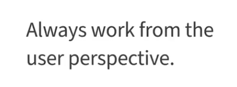
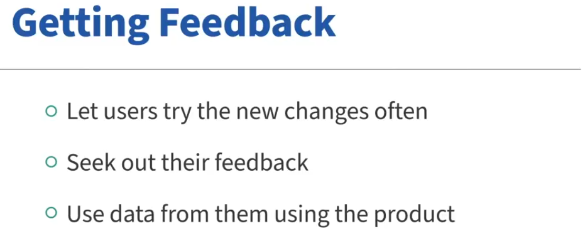
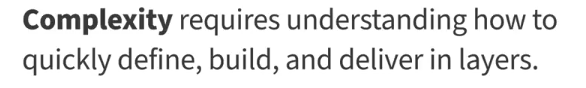
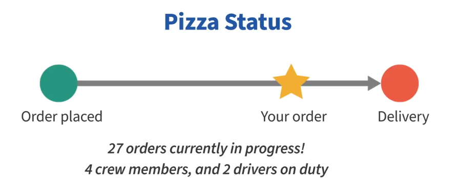
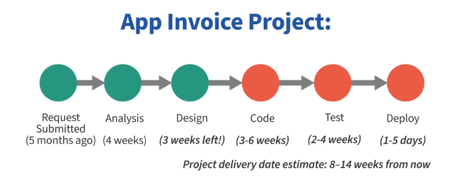
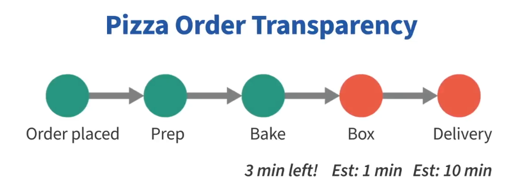
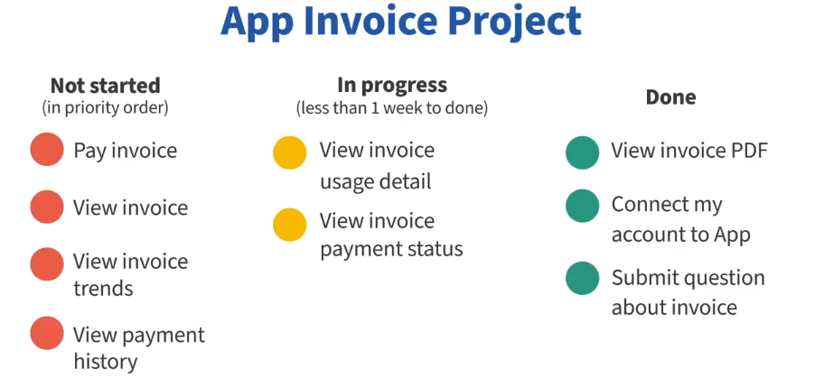
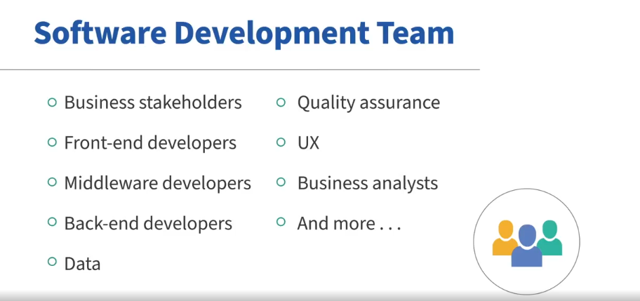

# Agile Business Analysis: The Business Analyst Role in Agile  

Lecture 1  

## Key Concepts  

### Importance of Analysis  
- Critical for facilitating dialogue on **customer value** and **scenarios**.  
- Focuses on **gaps, impacts**, and **value-driven decisions**.  

### Role of Feedback  
- Ensures what is built is **valuable** through feedback from:  
  - **Users**.  
  - **Data**.  
  - **Product vision and success metrics**.  

### Responsibilities of an Agile BA  
- **Facilitate shared understanding** and decision-making.  
- Break down product priorities into **small, value-driven tasks**.  
- Align current work with the **big picture** vision.  

### Agile Documentation  
- Serves as a **conversation starter** and **memory aid**.  
- Lightweight and continuously updated (e.g., **user scenarios**, **models**, **data flows**).  

### Balancing Work  
- Supports **current work**, **upcoming tasks**, and the **long-term solution**.  

# Agile Business Analysis: The Agile Manifesto from a Business Analyst Perspective  
Lecture 2

## Key Concepts  

### Agile Manifesto Overview  
- Agile is a **mindset**, not a methodology.  
- Built on **4 values** and **12 principles** applicable beyond software development.  
- Focus areas: **Feedback**, **Teamwork**, and **Delivering Value**.  

---

### The Four Values from a BA Perspective  

1. **Individuals and Interactions Over Processes and Tools**  
   - Prioritize **people** and **collaboration**.  
   - Drive requirements with a **user-first approach**.  

2. **Working Software Over Comprehensive Documentation**  
   - Get feedback from **working products**, not documents.  
   - Facilitate **value delivery** over documentation handoffs.  

3. **Customer Collaboration Over Contract Negotiation**  
   - Build **shared understanding** through dialogue.  
   - Adapt to **changing needs** as new insights emerge.  

4. **Responding to Change Over Following a Plan**  
   - Plan based on **value and outcomes**, not rigid schedules.  
   - Measure progress through **business results** and **user behavior**.  

---

### Continuous Improvement  
- Agile promotes **learning** and **adapting** to uncover better ways of working.  
- Focus on **outcomes** over outputs.  

# Agile Business Analysis: Embracing the Agile Mindset  
Lecture 3
## Key Concepts  

### What Is Agile?  
- Agile is a **mindset** and **way of working**, not a methodology.  
- Focuses on:  
  - **Teamwork**, **outcomes**, and **feedback**.  
  - Adapting to ambiguity and changing contexts.  
  - Enabling true agility: the ability to **pivot and adapt** without waiting for work to finish.  

---

### Core Practices for Agile BAs  
1. **Defining Work in Small Increments**  
   - Break down work into small, feedback-driven increments.  
   - Use fast feedback to **reduce risk** and ensure real progress.  

2. **Facilitating Analysis and Communication**  
   - Analyze, define, and communicate increments to teams and stakeholders.  
   - Help teams focus on **value delivery** and risk reduction.  

3. **Owning the BA Role**  
   - Embrace how analysis skills contribute to agile success.  
   - Reflect on behaviors and continuously improve for more agile practices.  

---

### Agile as a Journey  
- Agile is an **intentional and ongoing practice**.  
- Focus on:  
  - Learning, adapting, and improving.  
  - Reducing risk and delivering value sooner in complex environments.  
# Key Agile Values and Principles for BAs  
Lecture 4
## Key Principles for Business Analysis  

### Principle 1: Satisfy the Customer Through Early and Continuous Delivery  
- Prioritize **small, incremental value** that is usable and feedback-driven.  
- BAs facilitate dialogue with the product owner to ensure what’s built aligns with customer needs.  

### Principle 2: Welcome Changing Requirements  
- **Changing requirements** are seen as opportunities for **product improvement**.  
- BAs help incorporate evolving needs into the product backlog and priorities.  

### Principle 7: Working Software as the Primary Measure of Progress  
- Progress is measured by **working software** rather than documents.  
- BAs ensure that feedback loops are in place to guide requirements and designs.  

### Principle 10: Simplicity — Maximize the Work Not Done  
- BAs help the team focus on the **most valuable** tasks, ensuring that only high-priority work is completed.  
- Aim for **focus, feedback**, and **value-driven delivery**.  

---

## Summary  
- The Agile principles emphasize the **importance of feedback**, **adaptation**, and **delivering value** in small increments.  
- BAs play a crucial role in aligning teams with customer needs and continuously refining the product backlog.

# Agile Ways of Working for BAs
Lecture 5
## Key Agile Ways of Working  

### 1. Collaborating on Design Details in Real Time  
- **Details** (e.g., database fields, UI design) are handled in collaboration with the development team during the work process, not upfront.  
- Avoid documenting **technical details** early to prevent delays and allow for flexibility.  

### 2. Continuous Analysis and Improvement  
- **Analysis** is an ongoing process, not a one-time phase.  
- Focus on continuous improvement by reflecting with the team and stakeholders, reducing waste, and increasing value.  

### 3. Maintaining the Big Picture  
- Keep sight of the **bigger picture** and the **"why"** behind each detail.  
- Ensure that every detail aligns with the overall goal and contributes to the solution.

---

## Summary  
- Agile BAs focus on **collaboration**, **continuous improvement**, and **maintaining the big picture** to deliver better solutions and drive value.  
- These practices emphasize **flexibility**, **teamwork**, and **feedback**, which are core to the Agile mindset.

# Business Analyst Point of View on an Agile Team
Lecture 6
## Key Points of View for Agile BAs

### 1. User Delight
- Always ask, **"Would the end customer or user be delighted by this?"**
- Connect your work to the user experience, ensuring the team understands its impact.
  
### 2. Flexibility
- Your role as a BA is **flexible**. Focus on contributing value, even if it means stepping outside your comfort zone.
- If unsure of what to work on, **ask your team** how you can help in the current sprint.

### 3. Learning and Discovery
- Requirements **change constantly**, so focus on small, incremental work to adapt quickly.
- **Develop requirements just in time** and keep the bigger picture in mind to avoid waste.
- Treat requirements as an ongoing **discovery process** where changes are expected.

---

## Summary  
An Agile BA maintains a **user-centric mindset**, stays **flexible**, and treats requirements as part of an ongoing **learning and discovery** process to adapt to changing needs.

# Agile: User Focus
Lecture 7
## Key Concepts of User Focus in Agile

### 1. The Human Factor
- Agile focuses on the **customer** or **end user** as the center of analysis. Even in technical projects, always consider the **human impact**.
- Always aim to **connect the technology to the user** and work from a **user perspective**.

### 2. Daily Stand-Up Meetings
- During stand-ups, ensure the team understands how each task impacts the **user experience**.
- Help the team connect their work to **user scenarios**, ensuring all parts of the project fit together cohesively.

### 3. Backlog Refinement
- In backlog refinement, help the team focus on the **user scenario** when discussing technical details. This will help with decision-making and estimating.
- Reframe technical discussions to **align with user scenarios**.

### 4. Prioritization Based on User Needs
- When many user scenarios are identified, help prioritize them based on the **business goals** and **user needs**.

### 5. Understanding Users in Technical Products
- Even for **technical pieces** that don't have a direct user, remember that **every action taken by the user** impacts the **technical layers** that process that action.
- The **technical layers** must be analyzed to ensure they align with each user scenario.

---

## Summary  
Keeping a **user-focused mindset** in Agile helps teams create better solutions by aligning technical work with user needs and scenarios, ensuring that every decision ultimately benefits the end user.

# Agile: Feedback
Lecture 8
## Key Concepts of Feedback in Agile

### 1. The Importance of Feedback
- **Feedback** is the cornerstone of Agile development. It informs how well users are accomplishing their goals with the product.
- Feedback can come from **users** directly or from data about how they interact with the product.

### 2. Proactive vs Reactive Feedback
- Simply asking users for feedback or reacting to issues they submit is **insufficient**. 
- The goal is to track **user behaviors** that signal success, and gather **continuous feedback** about how well users can use the product.

### 3. Tracking Success
- For example, if you're building a feature that allows customers to get account information without calling support, track how many users can successfully use the feature instead of calling.
- If **users continue to call support**, this indicates that the feature isn't working as expected.

### 4. Releasing and Using Feedback Continuously
- Releasing features frequently helps gather **continuous feedback** and adjust accordingly.
- Feedback should be integrated into the planning, building, and demoing stages, with the team working from a **user perspective**.
- Tools for gathering feedback include **data analytics, surveys, customer feedback**, and **focus groups**.

### 5. Using Feedback Effectively
- Aligning feedback with **user behavior metrics** and **product goals** is crucial for improving the product.
- Feedback helps prioritize what to build next and informs whether the team is on the right track.

---

## Summary  
In Agile, **continuous feedback** is essential for understanding if the product is meeting user needs and helps in **prioritizing work**. It’s not about just reacting to issues, but using data and user behavior to adjust and improve the product iteratively.

# Agile: Incremental Progress
Lecture 9
## Key Concepts of Incremental Progress in Agile

### 1. Learning from Small Experiments
- Imagine starting a garden. Instead of crafting a perfect plan over months and risking failure later, you would **experiment, learn**, and **iterate**.
- Incremental progress allows you to **maximize timing**, **order experiments**, and adapt the plan as you learn from early successes.

### 2. The Problem with Over-Planned Projects
- Planning everything in advance can result in **delayed success** and **higher risk** .
- If the plan goes wrong, it may take too long to recover.
- Incremental work reduces risk, allows for **quick wins**, and **changes the overall plan** based on results.

### 3. Incremental and Iterative Planning in Business
- **Business leaders** naturally understand the value of incremental progress. They want to see results sooner, even if it means starting with less than the full project.
- **Agility** is about tracking progress, learning, and achieving results within a predefined scope.

### 4. The Challenge of Predictability
- Many teams still cling to estimates, budgets, and timelines to create predictability. However, as environments become more complex, true predictability becomes harder to achieve.
- Incremental and iterative approaches are reducing risks and allowing teams to find success.

### 5. Example: Mobile App Development
- In the case of building a mobile app, a **Business Analyst (BA)** works with the business leader to define **user groups** and create **user stories**.
- **Option A:** After three weeks, the team completes 40% of the product's requirements, with six months remaining for design, coding, testing, and deployment.
- **Option B:** After three weeks, the team demos the most requested feature, enabling decision-makers to deploy a basic app with one feature or wait. Progress is visible early, and a decision can be made sooner.
- Most would prefer **Option B**, which is an example of **incremental progress** that reduces risk and shows results sooner.

---

## Summary
In Agile, **incremental progress** allows for **early results**, **learning** through experimentation, and **adaptation** of the plan. It reduces risk and increases the likelihood of success by providing constant feedback and progress, even if it's not the complete project scope.

# Agile: Plan in Layers

## Overview
Agile teams excel by planning extensively, but they **plan in layers** to ensure clarity, flexibility, and alignment with user needs. Each layer of planning corresponds to a level of detail and timing, much like the Earth's layers (crust, mantle, core). This structured approach helps Agile teams deliver value while adapting to feedback and change.

---

## The Five Layers of Agile Planning

Lecture 10
### 1. **Product Vision**
- **Purpose:** Defines the **big picture** of what each user group will accomplish with the solution.
- **Timeline:** Long-term (6 months to a year).
- **Focus:** Imagining the overall value and impact for users.

### 2. **Product Roadmap**
- **Purpose:** Outlines the **major user value items** and the order of work.
- **Perspective:** Focused on **user value**, not technical implementation.
- **Detail:** Less specific for further-out milestones to account for learning and change.
- **Note:** The roadmap is **not a promise of dates** but a conceptual plan to deliver value.

### 3. **Release Plan**
- **Purpose:** Adds more detail while maintaining a **customer perspective**.
- **Flexibility:** Adjusts as feedback is received and learning occurs.
- **Planning:** Teams may plan a few releases conceptually but adapt content based on real-world feedback.

### 4. **Iteration (Sprint) Plan**
- **Purpose:** Defines the specific user stories and tasks for a short period (a sprint).
- **Timeline:** Created every few days or weeks.
- **Focus:** Remains **user-focused** with clear deliverables tied to **user value**.
- **Process:** Teams select user stories and break them into tasks needed to meet the acceptance criteria.

### 5. **Daily Planning**
- **Purpose:** Organizes the team’s day-to-day collaboration to meet user story criteria.
- **Focus:** Ensures alignment and smooth progress towards sprint goals.

---

## Common Mistakes in Planning
- **Skipping Layers:** Going straight from a leader’s vision to user stories and tasks.
- **Consequences:** 
  - Missed expectations.
  - Scope creep.
  - Lack of shared understanding.
  - Missed deadlines.
  - Unsatisfied users.

---

## Role of the Business Analyst (BA)
- The BA plays a crucial role in guiding **all five levels** of planning.
- **Key Skills:** 
  - Strong analysis skills to define plans at each level.
  - Facilitation skills to help stakeholders and teams align on decisions.

---

## Summary
Agile planning in layers ensures:
- **Clarity** in vision and direction.
- **Flexibility** to adapt to changes and feedback.
- **Focus** on delivering value to users at every step.

Review your team’s planning process to ensure all five levels are addressed effectively!

# VUCA: Volatility, Uncertainty, Complexity, and Ambiguity

## Overview
We live in a **VUCA world**, characterized by increasing **Volatility, Uncertainty, Complexity, and Ambiguity**. This dynamic landscape makes Agile approaches highly valuable for organizations. Understanding VUCA helps Agile Business Analysts (BAs) navigate changing environments and align their work with the demands of modern business and technology.

---

## The Components of VUCA

### 1. **Volatility**

- **Definition:** Rapid and unpredictable changes in industries, technology, and customer interactions.
- **Impact:** Disrupts priorities and requirements.
- **BA Approach:** 
  - Be prepared for constant change.
  - Stay adaptable to shifts in technology and business needs.

### 2. **Uncertainty**

- **Definition:** The unknowns in a rapidly evolving world where needs and opportunities emerge unpredictably.
- **Impact:** Creates difficulty in forecasting and planning.
- **BA Approach:** 
  - Use **just-in-time requirements** based on learning and data.
  - Leverage insights to pivot quickly and meet customer needs.

### 3. **Complexity**

- **Definition:** Interconnected parts and variables in organizations, products, and customers.
- **Impact:** Challenges understanding, defining, and delivering value.
- **BA Approach:** 
  - Simplify complexity by focusing on small increments for learning and delivery.
  - Define the essential details and eliminate unnecessary noise.
  - Deliver, learn, and iterate simultaneously.

### 4. **Ambiguity**

- **Definition:** Lack of clarity or certainty about meaning, direction, or outcomes.
- **Impact:** Leads to confusion and indecision.
- **BA Approach:**
  - Formulate **hypotheses** and design quick **experiments** to test them.
  - Use experiments to gather actionable insights.
  - Define conditions for value creation and refine hypotheses based on results.

---

## Agile BAs in a VUCA World
- Agile BAs **co-create, learn, and adapt** continuously.
- They balance **analysis and action** to cut through ambiguity and reduce risks.
- By embracing VUCA, Agile BAs bring greater agility and innovation to their work.

---

## Practical Steps for BAs in a VUCA World
1. **Understand VUCA's Impact:**
   - Recognize volatility, uncertainty, complexity, and ambiguity in your context.
2. **Leverage Agile Practices:**
   - Embrace iterative delivery and just-in-time requirements gathering.
3. **Experiment and Learn:**
   - Use data-driven insights and rapid experimentation to navigate challenges.
4. **Simplify Complexity:**
   - Focus on essential increments that drive learning and value.

---

## Conclusion
VUCA challenges us to rethink traditional approaches to requirements and planning. By understanding and addressing VUCA, Agile BAs empower their teams to be nimble, innovative, and resilient in a rapidly changing world.

# Agile: Transparency

## Overview
Transparency is a cornerstone of Agile practices, fostering clear communication and shared understanding between teams and stakeholders. It ensures that everyone can see and interpret progress meaningfully, avoiding miscommunication and unnecessary micromanagement.

---

## Why Transparency Matters
- **Improves Stakeholder Understanding:** 
  Stakeholders need status updates that are **clear** and **meaningful** to their interests, not just technical progress.
- **Reduces Micromanagement:**
  Transparent progress reduces the need for stakeholders to fill in gaps with assumptions or demand excessive details.
- **Supports Agile Planning:**
  Planning from a **user perspective** enables transparency and helps stakeholders attach meaning to the team's progress.

---

## Examples of Transparency in Agile

### 1. Poor Transparency
Imagine tracking a pizza order with unclear updates:
- Example: *"Pizza is at step 4 out of 10."*  

  - This doesn’t provide actionable insight for the customer, such as when the pizza will arrive.  
Similarly, in Agile, progress reports framed in technical terms (e.g., "backend APIs 80% complete") may confuse stakeholders.

### 2. Effective Transparency
Now imagine the same pizza order with meaningful updates:
- Example: *"Your pizza is in the oven and will arrive in 15 minutes."*  

  - This is actionable and clear.  
In Agile, progress framed in **user-focused terms** (e.g., "Users can now log in and view their account details") makes progress meaningful to stakeholders.

---

## Benefits of Transparency
1. **Clear Communication:**  
   Progress updates are framed in terms of **what users can do**, rather than technical jargon.  
   - Example: "Users can now pay invoices online" instead of "Payment module development is complete."
2. **Reduces Overhead:**  
   Teams spend less time on administrative tasks and status reporting.
3. **Encourages Collaboration:**  
   Transparency fosters open conversations about risks, priorities, and deadlines.

---

## The Business Analyst's Role
- **Plan from the User Perspective:**  
  Ensure progress is defined in terms stakeholders can understand.  
- **Visual Management:**  
  Use tools like Kanban boards or status trackers that visually convey progress meaningfully.  
- **Facilitate Discussions:**  
  Help teams and stakeholders have meaningful conversations about progress, risks, and goals.

---

## Practical Tips for Transparency
1. **User-Focused Updates:**  
   Always frame progress in terms of user or business outcomes.
2. **Simplify Visuals:**  
   Use clear, intuitive visuals that stakeholders can quickly interpret.
3. **Frequent Updates:**  
   Provide regular updates to maintain alignment and reduce assumptions.
4. **Collaborate Openly:**  
   Use transparency as a foundation for productive discussions about scope, risks, and priorities.

---

## Conclusion
Transparency bridges the gap between Agile teams and stakeholders, enabling meaningful conversations, reducing misunderstandings, and aligning everyone toward shared goals. By planning and communicating progress from a user perspective, teams can deliver better outcomes while fostering trust and collaboration.

# Agile: Limiting Work in Progress (WIP)

## Overview
Limiting Work in Progress (WIP) is a core Agile practice that helps teams focus, collaborate, and deliver better outcomes. By working on fewer items at a time, teams achieve greater quality, speed, and alignment. This approach is not just for crisis situations but is a sustainable practice for any Agile team.

---

## Benefits of Limiting WIP
1. **Improved Focus:**  
   Teams can concentrate on a single goal without distractions.
2. **Higher Quality:**  
   Fewer context switches lead to better attention to detail and results.
3. **Faster Delivery:**  
   Teams complete work more quickly by focusing on one item at a time.
4. **Clearer Expectations:**  
   Stakeholders and teams align on priorities and progress.

---

## Key Elements for Limiting WIP
### 1. **User-Centered Backlog Items**
- Backlog items, like user stories, must be written from the **end user's perspective**, free of technical jargon.  
- This allows everyone, regardless of their role, to contribute meaningfully.  
- **Role of the Business Analyst:**  
  Ensure backlog items clearly define user goals and are not broken down into technical tasks.

### 2. **Cross-Functional Teams**
- Teams must have all the skills required to complete work from start to finish without dependencies on other teams.  
- This autonomy enables faster delivery and seamless collaboration.

### 3. **Stakeholder Alignment**
- The product owner and business analyst must communicate clearly with stakeholders about prioritization and focus.  
- **Key Message:** Only one item will be worked on at a time, and urgent changes will require stopping current work.

---

## Example: All Hands on Deck
In crisis scenarios, teams often limit WIP naturally:
- Everyone focuses on a single problem, working together to solve it.  
- This intense focus improves quality and speed.  
**Takeaway:** The same principles can be applied proactively in Agile to achieve similar results without a crisis.

---

## Challenges and Solutions
### **Challenge:** Lack of Cross-Functional Teams  
- **Solution:** Build teams with diverse skills to handle all aspects of delivery.  

### **Challenge:** Stakeholder Pushback on Prioritization  
- **Solution:** Use transparent communication to explain the benefits of focusing on fewer tasks.

### **Challenge:** Poorly Defined Backlog Items  
- **Solution:** Business analysts ensure items are user-focused and understandable by all team members.

---

## The Role of Business Analysts
Business analysts are critical to the success of limiting WIP:
1. **Define Problems and Goals:**  
   Clearly articulate what the team is working on and why.  
2. **Craft User-Focused Stories:**  
   Write backlog items that are actionable and goal-oriented.  
3. **Facilitate Collaboration:**  
   Help the team and stakeholders align around shared objectives.  
4. **Manage Expectations:**  
   Communicate prioritization and focus to stakeholders effectively.

---

## Practical Tips for Limiting WIP
1. **Start Small:**  
   Limit WIP gradually to help the team adjust.
2. **Prioritize Effectively:**  
   Use tools like Kanban boards to visualize and prioritize work.
3. **Emphasize Collaboration:**  
   Encourage the team to work together on one item until it’s completed.
4. **Adapt as Needed:**  
   Be flexible when urgent tasks arise but return to focused work quickly.

---

## Conclusion
Limiting WIP is a powerful Agile practice that helps teams deliver high-quality work faster and with greater alignment. By focusing on one item at a time, fostering cross-functional collaboration, and writing user-centered backlog items, teams can achieve sustainable success while maintaining stakeholder trust and engagement.

# Agile: Cross-Functional Teams

## Overview
Cross-functional teams are a cornerstone of Agile practices, enabling collaboration across different roles to achieve a common goal. Whether in software development, process improvement, or marketing, these teams bring together diverse skills to deliver value faster and with higher quality.  

---

## What is a Cross-Functional Team?
A cross-functional team consists of members with varied expertise working collaboratively toward a shared objective.  
- **Example in Soccer:**  
  A soccer team combines roles like goalie, defenders, midfielders, and forwards to score a goal. Each role contributes uniquely, but success comes from their teamwork.  
- **Example in Software Development:**  
  Teams may include business stakeholders, front-end and back-end developers, data specialists, QA analysts, UX designers, and business analysts working together on a project.  

---

## Benefits of Cross-Functional Teams
1. **Eliminating Silos:**  
   Teams break down barriers between departments and roles, fostering collaboration and reducing delays.  

2. **Faster Delivery:**  
   Handoffs are minimized, enabling quicker progress through shared ownership and continuous collaboration.  

3. **Higher Quality:**  
   Diverse perspectives ensure gaps are filled, and work is reviewed from multiple angles.  

4. **Improved Relationships:**  
   Working closely builds trust and alignment, promoting better communication and teamwork.  

---

## Key Characteristics of Cross-Functional Teams
### 1. **Diverse Skill Sets**
- Teams should include all the skills necessary to deliver value without relying on external handoffs.  
- Examples:
  - **Software Development:** Includes developers, QA, UX, and business analysts.  
  - **Marketing:** Includes sales, content creators, analysts, and campaign strategists.  

### 2. **Shared Goals**
- All team members work toward the same goal, such as delivering a product increment or achieving a marketing campaign milestone.  

### 3. **Collaboration Over Handoffs**
- Teams collaborate in real-time, reducing waiting times and inefficiencies caused by task handoffs between silos.  

---

## Role of Business Analysts in Cross-Functional Teams
Business analysts play a vital role in ensuring cross-functional teams succeed by:
1. **Providing Clarity:**  
   Crafting well-written user stories that define the user’s needs and goals in simple, understandable terms.  

2. **Enabling Shared Understanding:**  
   Helping all roles align by framing the work from the user’s perspective.  

3. **Filling Gaps:**  
   Identifying and addressing potential overlaps or gaps in roles and responsibilities.  

4. **Facilitating Collaboration:**  
   Acting as the glue that connects technical and non-technical team members.  

---

## Practical Tips for Building Cross-Functional Teams
1. **Focus on User Goals:**  
   Define tasks and backlog items in terms of what the end user needs, not technical steps.  

2. **Empower the Team:**  
   Ensure the team has the skills and resources to work autonomously without relying on external teams.  

3. **Foster Communication:**  
   Use tools like daily stand-ups and Kanban boards to keep everyone aligned.  

4. **Leverage Business Analysts:**  
   Business analysts ensure the team remains focused on user value and avoids duplication or gaps.  

---

## Conclusion
Cross-functional teams are essential to Agile success, enabling faster delivery, higher quality, and stronger collaboration. By breaking down silos and fostering a shared understanding, teams can deliver exceptional results. Business analysts are crucial in enabling this collaboration, acting as the bridge between roles and ensuring all team members stay focused on delivering value to users.
# Agile: Reducing Handoffs

## Overview
In complex and uncertain environments, traditional workflows with numerous handoffs between siloed teams accumulate risk and inefficiency. Agile emphasizes reducing handoffs by enabling cross-functional teams to work collaboratively, focusing on user feedback and delivering value faster.

---

## Why Reducing Handoffs Matters
Handoffs between teams create bottlenecks and risks, such as:  
- **Delays:** Work often waits for other teams to have the capacity to take it on, slowing overall progress.  
- **Increased Coordination Overhead:** Managing dependencies, task switching, and extensive meetings wastes time.  
- **Risk Accumulation:** Without early and continuous user feedback, the solution might not meet user or business needs.  
- **Lower Overall Efficiency:** While individual teams may optimize their work, the organization’s overall efficiency suffers.  

---

## Benefits of Reducing Handoffs
1. **Faster Delivery:**  
   Eliminating waits and reducing dependencies speeds up the delivery process.  

2. **Higher Quality:**  
   Collaborative efforts enable early and continuous feedback, leading to better solutions.  

3. **Increased Focus on Value:**  
   Teams can focus on delivering value directly to users instead of managing chaotic dependencies.  

4. **Improved User Alignment:**  
   Continuous feedback ensures that the product aligns with user needs and expectations.  

---

## Role of Business Analysts in Reducing Handoffs
Business analysts are essential in Agile teams to facilitate the reduction of handoffs by:  
1. **Encouraging Collaboration:**  
   Facilitating conversations among cross-functional teams to work together instead of in silos.  

2. **Prioritizing Feedback:**  
   Helping the team focus on delivering items that can be demoed and tested by users.  

3. **Crafting Effective User Stories:**  
   Writing user stories that are actionable and free from technical details, allowing all roles to contribute.  

4. **Promoting Transparency:**  
   Ensuring the backlog reflects priorities that minimize dependencies and support collaborative work.  

---

## How to Reduce Handoffs in Agile Teams
1. **Work as a Cross-Functional Team:**  
   Break silos and bring together all necessary skills within a single team.  

2. **Focus on Delivering Usable Increments:**  
   Prioritize backlog items that can be delivered to and used by end users for immediate feedback.  

3. **Facilitate Communication:**  
   Use business analysis to foster alignment and clarity on shared goals and user needs.  

4. **Prioritize Learning:**  
   Design workflows that emphasize iterative improvements based on user feedback, rather than isolated task completion.  

5. **Minimize Dependencies:**  
   Identify areas where work can be handled end-to-end by the team, reducing reliance on external inputs.  

---

## Practical Example: Reducing Handoffs in Action
### Traditional Workflow:  
1. Team A develops a feature and hands it off to Team B for integration.  
2. Team B completes integration and passes it to Team C for testing.  
3. Team C tests, identifies bugs, and sends it back to Team A.  

### Agile Workflow:  
A cross-functional team (including developers, integrators, and testers) collaborates to build, integrate, and test the feature simultaneously.  

---

## Conclusion
Reducing handoffs is a fundamental Agile principle that helps teams deliver value faster, with better quality, and less risk. Business analysts play a crucial role in enabling this by facilitating collaboration, crafting effective user stories, and helping teams focus on user feedback. By working together, Agile teams can minimize dependencies and achieve the pace and quality they aim for.

# Agile: Extreme Collaboration

## Overview
Collaboration is essential in Agile, but not all collaboration is equally impactful. **Extreme collaboration** goes beyond routine communication to foster deep connections, creativity, and innovation. It involves active participation, healthy challenges, and working together to solve problems and create value.

---

## Low-Impact vs. High-Impact Collaboration

### Examples of Low-Impact Collaboration:
- Sending emails back and forth.
- Chat threads with updates or questions.
- Meetings with strict agendas where attendees provide updates.
- Reviewing documents where only one person presents and updates them.

### Characteristics of High-Impact Collaboration:
1. **Deep Conversations:**  
   Teams engage in meaningful discussions, asking tough questions and exploring different perspectives.  

2. **Divergent Thinking:**  
   Encourages creativity by exploring multiple ideas before converging on a decision.  

3. **Active Contribution:**  
   Everyone participates in creating and refining documents, models, or whiteboards, rather than relying on a single person.  

4. **Real Work in Meetings:**  
   Meetings focus on achieving outcomes collaboratively, rather than just sharing updates.  

5. **Shared Innovation:**  
   Combines the unique skills and knowledge of team members to connect dots and innovate together.  

---

## Benefits of Extreme Collaboration
1. **Fosters Creativity:**  
   Encourages out-of-the-box thinking and problem-solving.  

2. **Strengthens Team Dynamics:**  
   Builds trust and understanding through healthy challenges and shared contributions.  

3. **Inspires Innovation:**  
   Enables teams to connect diverse knowledge and perspectives for better solutions.  

4. **Enhances Productivity:**  
   Combines solo deep thinking with group synergy to achieve more focused results.  

---

## Role of Business Analysts in Extreme Collaboration
Business analysts (BAs) are central to fostering extreme collaboration on Agile teams by:  
1. **Connecting Stakeholders:**  
   Bringing together diverse knowledge and perspectives from different stakeholders.  

2. **Facilitating High-Impact Meetings:**  
   Leading discovery sessions, backlog refinement, and collaborative workshops.  

3. **Encouraging Divergent Thinking:**  
   Inspiring teams to explore multiple possibilities before reaching consensus.  

4. **Synthesizing Knowledge:**  
   Helping teams see how individual parts contribute to the bigger picture.  

5. **Enabling Shared Understanding:**  
   Ensuring everyone understands how their contributions connect to the team’s goals.  

---

## How to Encourage Extreme Collaboration
1. **Promote Participation:**  
   Design meetings where all team members actively contribute, such as working on a shared whiteboard or document.  

2. **Foster Open Communication:**  
   Encourage healthy challenges and discussions to explore diverse perspectives.  

3. **Combine Individual and Group Work:**  
   Balance solo deep thinking with collaborative sessions to leverage both creativity and focus.  

4. **Focus on Outcomes:**  
   Shift meeting agendas from updates to actionable, collaborative work.  

5. **Ask Tough Questions:**  
   Push the team to think critically and challenge assumptions.  

---

## Practical Example: Extreme Collaboration in Action
### Low-Impact Example:  
- A meeting where one person presents a solution, and others provide feedback without significant engagement.  

### High-Impact Example:  
- A brainstorming session where the team uses a shared whiteboard to map out ideas, challenge assumptions, and refine solutions collaboratively.  

---

## Conclusion
Extreme collaboration is a cornerstone of Agile teamwork, inspiring creativity, innovation, and productivity. Business analysts play a vital role by facilitating high-impact collaboration, connecting stakeholders, and driving meaningful conversations. By pushing boundaries and fostering a balance of deep thinking and group synergy, Agile teams can unlock their full potential.

# Day in the Life of an Agile Business Analyst

## Overview
An Agile BA is a busy, dynamic role, closely working with the product owner, delivery team, and stakeholders. The day involves meetings, facilitation, analysis, and relationship-building while balancing priorities and focusing on delivering value.

---

## Typical Daily Activities

1. **Start with a Standup:**
   - Kick off the day with the team's daily standup meeting.
   - Review progress and align priorities.

2. **Plan Your Day:**
   - Focus on tasks where you can add the most value.
   - Examples: Testing new features or providing team feedback.

3. **Meetings and Collaboration:**
   - Participate in or facilitate discussions with teams, product managers, or leaders.
   - Prep for future meetings and analyze the product backlog.

4. **Balance People and Analysis Skills:**
   - Switch between individual focus time, stakeholder one-on-ones, and group dialogues.
   - Manage competing priorities tactfully and with influence.

5. **Documentation:**
   - Keep documentation lightweight and value-driven.
   - Avoid unnecessary busywork; focus on creating references that support immediate tasks and the big picture.

6. **Quick Decision-Making:**
   - Assess incoming requests and determine their relevance.
   - Communicate decisions effectively to maintain focus.

---

## Key Skills for Success
- **Facilitation:** Lead productive discussions and align teams.
- **Tact and Influence:** Work without direct authority to drive outcomes.
- **Focus and Prioritization:** Manage time and attention wisely.
- **Big Picture Thinking:** Balance immediate tasks with long-term goals.

---

## Highlights of the Role
- High-impact and meaningful contributions.
- Minimal busywork, focusing on what drives real value.
- Opportunities to shape team success through collaboration and analysis.

An Agile BA’s role is dynamic, rewarding, and critical to team success. Make the most of it by staying intentional and focused.
