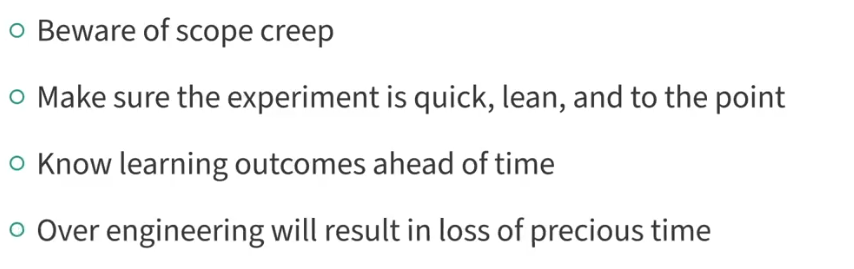

# Agile Business Analysis: The Business Analyst Role in Agile  

Lecture 1  

## Key Concepts  

### Importance of Analysis  
- Critical for facilitating dialogue on **customer value** and **scenarios**.  
- Focuses on **gaps, impacts**, and **value-driven decisions**.  

### Role of Feedback  
- Ensures what is built is **valuable** through feedback from:  
  - **Users**.  
  - **Data**.  
  - **Product vision and success metrics**.  

### Responsibilities of an Agile BA  
- **Facilitate shared understanding** and decision-making.  
- Break down product priorities into **small, value-driven tasks**.  
- Align current work with the **big picture** vision.  

### Agile Documentation  
- Serves as a **conversation starter** and **memory aid**.  
- Lightweight and continuously updated (e.g., **user scenarios**, **models**, **data flows**).  

### Balancing Work  
- Supports **current work**, **upcoming tasks**, and the **long-term solution**.  

# Agile Business Analysis: The Agile Manifesto from a Business Analyst Perspective  
Lecture 2

## Key Concepts  

### Agile Manifesto Overview  
- Agile is a **mindset**, not a methodology.  
- Built on **4 values** and **12 principles** applicable beyond software development.  
- Focus areas: **Feedback**, **Teamwork**, and **Delivering Value**.  

---

### The Four Values from a BA Perspective  

1. **Individuals and Interactions Over Processes and Tools**  
   - Prioritize **people** and **collaboration**.  
   - Drive requirements with a **user-first approach**.  

2. **Working Software Over Comprehensive Documentation**  
   - Get feedback from **working products**, not documents.  
   - Facilitate **value delivery** over documentation handoffs.  

3. **Customer Collaboration Over Contract Negotiation**  
   - Build **shared understanding** through dialogue.  
   - Adapt to **changing needs** as new insights emerge.  

4. **Responding to Change Over Following a Plan**  
   - Plan based on **value and outcomes**, not rigid schedules.  
   - Measure progress through **business results** and **user behavior**.  

---

### Continuous Improvement  
- Agile promotes **learning** and **adapting** to uncover better ways of working.  
- Focus on **outcomes** over outputs.  

# Agile Business Analysis: Embracing the Agile Mindset  
Lecture 3
## Key Concepts  

### What Is Agile?  
- Agile is a **mindset** and **way of working**, not a methodology.  
- Focuses on:  
  - **Teamwork**, **outcomes**, and **feedback**.  
  - Adapting to ambiguity and changing contexts.  
  - Enabling true agility: the ability to **pivot and adapt** without waiting for work to finish.  

---

### Core Practices for Agile BAs  
1. **Defining Work in Small Increments**  
   - Break down work into small, feedback-driven increments.  
   - Use fast feedback to **reduce risk** and ensure real progress.  

2. **Facilitating Analysis and Communication**  
   - Analyze, define, and communicate increments to teams and stakeholders.  
   - Help teams focus on **value delivery** and risk reduction.  

3. **Owning the BA Role**  
   - Embrace how analysis skills contribute to agile success.  
   - Reflect on behaviors and continuously improve for more agile practices.  

---

### Agile as a Journey  
- Agile is an **intentional and ongoing practice**.  
- Focus on:  
  - Learning, adapting, and improving.  
  - Reducing risk and delivering value sooner in complex environments.  
# Key Agile Values and Principles for BAs  
Lecture 4
## Key Principles for Business Analysis  

### Principle 1: Satisfy the Customer Through Early and Continuous Delivery  
- Prioritize **small, incremental value** that is usable and feedback-driven.  
- BAs facilitate dialogue with the product owner to ensure what’s built aligns with customer needs.  

### Principle 2: Welcome Changing Requirements  
- **Changing requirements** are seen as opportunities for **product improvement**.  
- BAs help incorporate evolving needs into the product backlog and priorities.  

### Principle 7: Working Software as the Primary Measure of Progress  
- Progress is measured by **working software** rather than documents.  
- BAs ensure that feedback loops are in place to guide requirements and designs.  

### Principle 10: Simplicity — Maximize the Work Not Done  
- BAs help the team focus on the **most valuable** tasks, ensuring that only high-priority work is completed.  
- Aim for **focus, feedback**, and **value-driven delivery**.  

---

## Summary  
- The Agile principles emphasize the **importance of feedback**, **adaptation**, and **delivering value** in small increments.  
- BAs play a crucial role in aligning teams with customer needs and continuously refining the product backlog.

# Agile Ways of Working for BAs
Lecture 5
## Key Agile Ways of Working  

### 1. Collaborating on Design Details in Real Time  
- **Details** (e.g., database fields, UI design) are handled in collaboration with the development team during the work process, not upfront.  
- Avoid documenting **technical details** early to prevent delays and allow for flexibility.  

### 2. Continuous Analysis and Improvement  
- **Analysis** is an ongoing process, not a one-time phase.  
- Focus on continuous improvement by reflecting with the team and stakeholders, reducing waste, and increasing value.  

### 3. Maintaining the Big Picture  
- Keep sight of the **bigger picture** and the **"why"** behind each detail.  
- Ensure that every detail aligns with the overall goal and contributes to the solution.

---

## Summary  
- Agile BAs focus on **collaboration**, **continuous improvement**, and **maintaining the big picture** to deliver better solutions and drive value.  
- These practices emphasize **flexibility**, **teamwork**, and **feedback**, which are core to the Agile mindset.

# Business Analyst Point of View on an Agile Team
Lecture 6
## Key Points of View for Agile BAs

### 1. User Delight
- Always ask, **"Would the end customer or user be delighted by this?"**
- Connect your work to the user experience, ensuring the team understands its impact.
  
### 2. Flexibility
- Your role as a BA is **flexible**. Focus on contributing value, even if it means stepping outside your comfort zone.
- If unsure of what to work on, **ask your team** how you can help in the current sprint.

### 3. Learning and Discovery
- Requirements **change constantly**, so focus on small, incremental work to adapt quickly.
- **Develop requirements just in time** and keep the bigger picture in mind to avoid waste.
- Treat requirements as an ongoing **discovery process** where changes are expected.

---

## Summary  
An Agile BA maintains a **user-centric mindset**, stays **flexible**, and treats requirements as part of an ongoing **learning and discovery** process to adapt to changing needs.

# Agile: User Focus
Lecture 7
## Key Concepts of User Focus in Agile

### 1. The Human Factor
- Agile focuses on the **customer** or **end user** as the center of analysis. Even in technical projects, always consider the **human impact**.
- Always aim to **connect the technology to the user** and work from a **user perspective**.

### 2. Daily Stand-Up Meetings
- During stand-ups, ensure the team understands how each task impacts the **user experience**.
- Help the team connect their work to **user scenarios**, ensuring all parts of the project fit together cohesively.

### 3. Backlog Refinement
- In backlog refinement, help the team focus on the **user scenario** when discussing technical details. This will help with decision-making and estimating.
- Reframe technical discussions to **align with user scenarios**.

### 4. Prioritization Based on User Needs
- When many user scenarios are identified, help prioritize them based on the **business goals** and **user needs**.

### 5. Understanding Users in Technical Products
- Even for **technical pieces** that don't have a direct user, remember that **every action taken by the user** impacts the **technical layers** that process that action.
- The **technical layers** must be analyzed to ensure they align with each user scenario.

---

## Summary  
Keeping a **user-focused mindset** in Agile helps teams create better solutions by aligning technical work with user needs and scenarios, ensuring that every decision ultimately benefits the end user.

# Agile: Feedback
Lecture 8
## Key Concepts of Feedback in Agile

### 1. The Importance of Feedback
- **Feedback** is the cornerstone of Agile development. It informs how well users are accomplishing their goals with the product.
- Feedback can come from **users** directly or from data about how they interact with the product.

### 2. Proactive vs Reactive Feedback
- Simply asking users for feedback or reacting to issues they submit is **insufficient**. 
- The goal is to track **user behaviors** that signal success, and gather **continuous feedback** about how well users can use the product.

### 3. Tracking Success
- For example, if you're building a feature that allows customers to get account information without calling support, track how many users can successfully use the feature instead of calling.
- If **users continue to call support**, this indicates that the feature isn't working as expected.

### 4. Releasing and Using Feedback Continuously
- Releasing features frequently helps gather **continuous feedback** and adjust accordingly.
- Feedback should be integrated into the planning, building, and demoing stages, with the team working from a **user perspective**.
- Tools for gathering feedback include **data analytics, surveys, customer feedback**, and **focus groups**.

### 5. Using Feedback Effectively
- Aligning feedback with **user behavior metrics** and **product goals** is crucial for improving the product.
- Feedback helps prioritize what to build next and informs whether the team is on the right track.

---

## Summary  
In Agile, **continuous feedback** is essential for understanding if the product is meeting user needs and helps in **prioritizing work**. It’s not about just reacting to issues, but using data and user behavior to adjust and improve the product iteratively.

# Agile: Incremental Progress
Lecture 9
## Key Concepts of Incremental Progress in Agile

### 1. Learning from Small Experiments
- Imagine starting a garden. Instead of crafting a perfect plan over months and risking failure later, you would **experiment, learn**, and **iterate**.
- Incremental progress allows you to **maximize timing**, **order experiments**, and adapt the plan as you learn from early successes.

### 2. The Problem with Over-Planned Projects
- Planning everything in advance can result in **delayed success** and **higher risk** .
- If the plan goes wrong, it may take too long to recover.
- Incremental work reduces risk, allows for **quick wins**, and **changes the overall plan** based on results.

### 3. Incremental and Iterative Planning in Business
- **Business leaders** naturally understand the value of incremental progress. They want to see results sooner, even if it means starting with less than the full project.
- **Agility** is about tracking progress, learning, and achieving results within a predefined scope.

### 4. The Challenge of Predictability
- Many teams still cling to estimates, budgets, and timelines to create predictability. However, as environments become more complex, true predictability becomes harder to achieve.
- Incremental and iterative approaches are reducing risks and allowing teams to find success.

### 5. Example: Mobile App Development
- In the case of building a mobile app, a **Business Analyst (BA)** works with the business leader to define **user groups** and create **user stories**.
- **Option A:** After three weeks, the team completes 40% of the product's requirements, with six months remaining for design, coding, testing, and deployment.
- **Option B:** After three weeks, the team demos the most requested feature, enabling decision-makers to deploy a basic app with one feature or wait. Progress is visible early, and a decision can be made sooner.
- Most would prefer **Option B**, which is an example of **incremental progress** that reduces risk and shows results sooner.

---

## Summary
In Agile, **incremental progress** allows for **early results**, **learning** through experimentation, and **adaptation** of the plan. It reduces risk and increases the likelihood of success by providing constant feedback and progress, even if it's not the complete project scope.

# Agile: Plan in Layers

## Overview
Agile teams excel by planning extensively, but they **plan in layers** to ensure clarity, flexibility, and alignment with user needs. Each layer of planning corresponds to a level of detail and timing, much like the Earth's layers (crust, mantle, core). This structured approach helps Agile teams deliver value while adapting to feedback and change.

---

## The Five Layers of Agile Planning

Lecture 10
### 1. **Product Vision**
- **Purpose:** Defines the **big picture** of what each user group will accomplish with the solution.
- **Timeline:** Long-term (6 months to a year).
- **Focus:** Imagining the overall value and impact for users.

### 2. **Product Roadmap**
- **Purpose:** Outlines the **major user value items** and the order of work.
- **Perspective:** Focused on **user value**, not technical implementation.
- **Detail:** Less specific for further-out milestones to account for learning and change.
- **Note:** The roadmap is **not a promise of dates** but a conceptual plan to deliver value.

### 3. **Release Plan**
- **Purpose:** Adds more detail while maintaining a **customer perspective**.
- **Flexibility:** Adjusts as feedback is received and learning occurs.
- **Planning:** Teams may plan a few releases conceptually but adapt content based on real-world feedback.

### 4. **Iteration (Sprint) Plan**
- **Purpose:** Defines the specific user stories and tasks for a short period (a sprint).
- **Timeline:** Created every few days or weeks.
- **Focus:** Remains **user-focused** with clear deliverables tied to **user value**.
- **Process:** Teams select user stories and break them into tasks needed to meet the acceptance criteria.

### 5. **Daily Planning**
- **Purpose:** Organizes the team’s day-to-day collaboration to meet user story criteria.
- **Focus:** Ensures alignment and smooth progress towards sprint goals.

---

## Common Mistakes in Planning
- **Skipping Layers:** Going straight from a leader’s vision to user stories and tasks.
- **Consequences:** 
  - Missed expectations.
  - Scope creep.
  - Lack of shared understanding.
  - Missed deadlines.
  - Unsatisfied users.

---

## Role of the Business Analyst (BA)
- The BA plays a crucial role in guiding **all five levels** of planning.
- **Key Skills:** 
  - Strong analysis skills to define plans at each level.
  - Facilitation skills to help stakeholders and teams align on decisions.

---

## Summary
Agile planning in layers ensures:
- **Clarity** in vision and direction.
- **Flexibility** to adapt to changes and feedback.
- **Focus** on delivering value to users at every step.

Review your team’s planning process to ensure all five levels are addressed effectively!

# VUCA: Volatility, Uncertainty, Complexity, and Ambiguity
Lecture 11
## Overview
We live in a **VUCA world**, characterized by increasing **Volatility, Uncertainty, Complexity, and Ambiguity**. This dynamic landscape makes Agile approaches highly valuable for organizations. Understanding VUCA helps Agile Business Analysts (BAs) navigate changing environments and align their work with the demands of modern business and technology.

---

## The Components of VUCA

### 1. **Volatility**

- **Definition:** Rapid and unpredictable changes in industries, technology, and customer interactions.
- **Impact:** Disrupts priorities and requirements.
- **BA Approach:** 
  - Be prepared for constant change.
  - Stay adaptable to shifts in technology and business needs.

### 2. **Uncertainty**

- **Definition:** The unknowns in a rapidly evolving world where needs and opportunities emerge unpredictably.
- **Impact:** Creates difficulty in forecasting and planning.
- **BA Approach:** 
  - Use **just-in-time requirements** based on learning and data.
  - Leverage insights to pivot quickly and meet customer needs.

### 3. **Complexity**

- **Definition:** Interconnected parts and variables in organizations, products, and customers.
- **Impact:** Challenges understanding, defining, and delivering value.
- **BA Approach:** 
  - Simplify complexity by focusing on small increments for learning and delivery.
  - Define the essential details and eliminate unnecessary noise.
  - Deliver, learn, and iterate simultaneously.

### 4. **Ambiguity**

- **Definition:** Lack of clarity or certainty about meaning, direction, or outcomes.
- **Impact:** Leads to confusion and indecision.
- **BA Approach:**
  - Formulate **hypotheses** and design quick **experiments** to test them.
  - Use experiments to gather actionable insights.
  - Define conditions for value creation and refine hypotheses based on results.

---

## Agile BAs in a VUCA World
- Agile BAs **co-create, learn, and adapt** continuously.
- They balance **analysis and action** to cut through ambiguity and reduce risks.
- By embracing VUCA, Agile BAs bring greater agility and innovation to their work.

---

## Practical Steps for BAs in a VUCA World
1. **Understand VUCA's Impact:**
   - Recognize volatility, uncertainty, complexity, and ambiguity in your context.
2. **Leverage Agile Practices:**
   - Embrace iterative delivery and just-in-time requirements gathering.
3. **Experiment and Learn:**
   - Use data-driven insights and rapid experimentation to navigate challenges.
4. **Simplify Complexity:**
   - Focus on essential increments that drive learning and value.

---

## Conclusion
VUCA challenges us to rethink traditional approaches to requirements and planning. By understanding and addressing VUCA, Agile BAs empower their teams to be nimble, innovative, and resilient in a rapidly changing world.

# Agile: Transparency
Lecture 12
## Overview
Transparency is a cornerstone of Agile practices, fostering clear communication and shared understanding between teams and stakeholders. It ensures that everyone can see and interpret progress meaningfully, avoiding miscommunication and unnecessary micromanagement.

---

## Why Transparency Matters
- **Improves Stakeholder Understanding:** 
  Stakeholders need status updates that are **clear** and **meaningful** to their interests, not just technical progress.
- **Reduces Micromanagement:**
  Transparent progress reduces the need for stakeholders to fill in gaps with assumptions or demand excessive details.
- **Supports Agile Planning:**
  Planning from a **user perspective** enables transparency and helps stakeholders attach meaning to the team's progress.

---

## Examples of Transparency in Agile

### 1. Poor Transparency
Imagine tracking a pizza order with unclear updates:
- Example: *"Pizza is at step 4 out of 10."*  

  - This doesn’t provide actionable insight for the customer, such as when the pizza will arrive.  
Similarly, in Agile, progress reports framed in technical terms (e.g., "backend APIs 80% complete") may confuse stakeholders.

### 2. Effective Transparency
Now imagine the same pizza order with meaningful updates:
- Example: *"Your pizza is in the oven and will arrive in 15 minutes."*  

  - This is actionable and clear.  
In Agile, progress framed in **user-focused terms** (e.g., "Users can now log in and view their account details") makes progress meaningful to stakeholders.

---

## Benefits of Transparency
1. **Clear Communication:**  
   Progress updates are framed in terms of **what users can do**, rather than technical jargon.  
   - Example: "Users can now pay invoices online" instead of "Payment module development is complete."
2. **Reduces Overhead:**  
   Teams spend less time on administrative tasks and status reporting.
3. **Encourages Collaboration:**  
   Transparency fosters open conversations about risks, priorities, and deadlines.

---

## The Business Analyst's Role
- **Plan from the User Perspective:**  
  Ensure progress is defined in terms stakeholders can understand.  
- **Visual Management:**  
  Use tools like Kanban boards or status trackers that visually convey progress meaningfully.  
- **Facilitate Discussions:**  
  Help teams and stakeholders have meaningful conversations about progress, risks, and goals.

---

## Practical Tips for Transparency
1. **User-Focused Updates:**  
   Always frame progress in terms of user or business outcomes.
2. **Simplify Visuals:**  
   Use clear, intuitive visuals that stakeholders can quickly interpret.
3. **Frequent Updates:**  
   Provide regular updates to maintain alignment and reduce assumptions.
4. **Collaborate Openly:**  
   Use transparency as a foundation for productive discussions about scope, risks, and priorities.

---

## Conclusion
Transparency bridges the gap between Agile teams and stakeholders, enabling meaningful conversations, reducing misunderstandings, and aligning everyone toward shared goals. By planning and communicating progress from a user perspective, teams can deliver better outcomes while fostering trust and collaboration.

# Agile: Limiting Work in Progress (WIP)
Lecture 13
## Overview
Limiting Work in Progress (WIP) is a core Agile practice that helps teams focus, collaborate, and deliver better outcomes. By working on fewer items at a time, teams achieve greater quality, speed, and alignment. This approach is not just for crisis situations but is a sustainable practice for any Agile team.

---

## Benefits of Limiting WIP
1. **Improved Focus:**  
   Teams can concentrate on a single goal without distractions.
2. **Higher Quality:**  
   Fewer context switches lead to better attention to detail and results.
3. **Faster Delivery:**  
   Teams complete work more quickly by focusing on one item at a time.
4. **Clearer Expectations:**  
   Stakeholders and teams align on priorities and progress.

---

## Key Elements for Limiting WIP
### 1. **User-Centered Backlog Items**
- Backlog items, like user stories, must be written from the **end user's perspective**, free of technical jargon.  
- This allows everyone, regardless of their role, to contribute meaningfully.  
- **Role of the Business Analyst:**  
  Ensure backlog items clearly define user goals and are not broken down into technical tasks.

### 2. **Cross-Functional Teams**
- Teams must have all the skills required to complete work from start to finish without dependencies on other teams.  
- This autonomy enables faster delivery and seamless collaboration.

### 3. **Stakeholder Alignment**
- The product owner and business analyst must communicate clearly with stakeholders about prioritization and focus.  
- **Key Message:** Only one item will be worked on at a time, and urgent changes will require stopping current work.

---

## Example: All Hands on Deck
In crisis scenarios, teams often limit WIP naturally:
- Everyone focuses on a single problem, working together to solve it.  
- This intense focus improves quality and speed.  
**Takeaway:** The same principles can be applied proactively in Agile to achieve similar results without a crisis.

---

## Challenges and Solutions
### **Challenge:** Lack of Cross-Functional Teams  
- **Solution:** Build teams with diverse skills to handle all aspects of delivery.  

### **Challenge:** Stakeholder Pushback on Prioritization  
- **Solution:** Use transparent communication to explain the benefits of focusing on fewer tasks.

### **Challenge:** Poorly Defined Backlog Items  
- **Solution:** Business analysts ensure items are user-focused and understandable by all team members.

---

## The Role of Business Analysts
Business analysts are critical to the success of limiting WIP:
1. **Define Problems and Goals:**  
   Clearly articulate what the team is working on and why.  
2. **Craft User-Focused Stories:**  
   Write backlog items that are actionable and goal-oriented.  
3. **Facilitate Collaboration:**  
   Help the team and stakeholders align around shared objectives.  
4. **Manage Expectations:**  
   Communicate prioritization and focus to stakeholders effectively.

---

## Practical Tips for Limiting WIP
1. **Start Small:**  
   Limit WIP gradually to help the team adjust.
2. **Prioritize Effectively:**  
   Use tools like Kanban boards to visualize and prioritize work.
3. **Emphasize Collaboration:**  
   Encourage the team to work together on one item until it’s completed.
4. **Adapt as Needed:**  
   Be flexible when urgent tasks arise but return to focused work quickly.

---

## Conclusion
Limiting WIP is a powerful Agile practice that helps teams deliver high-quality work faster and with greater alignment. By focusing on one item at a time, fostering cross-functional collaboration, and writing user-centered backlog items, teams can achieve sustainable success while maintaining stakeholder trust and engagement.

# Agile: Cross-Functional Teams
Lecture 14
## Overview
Cross-functional teams are a cornerstone of Agile practices, enabling collaboration across different roles to achieve a common goal. Whether in software development, process improvement, or marketing, these teams bring together diverse skills to deliver value faster and with higher quality.  

---

## What is a Cross-Functional Team?
A cross-functional team consists of members with varied expertise working collaboratively toward a shared objective.  
- **Example in Soccer:**  
  A soccer team combines roles like goalie, defenders, midfielders, and forwards to score a goal. Each role contributes uniquely, but success comes from their teamwork.  
- **Example in Software Development:**  
  Teams may include business stakeholders, front-end and back-end developers, data specialists, QA analysts, UX designers, and business analysts working together on a project.  

---

## Benefits of Cross-Functional Teams
1. **Eliminating Silos:**  
   Teams break down barriers between departments and roles, fostering collaboration and reducing delays.  

2. **Faster Delivery:**  
   Handoffs are minimized, enabling quicker progress through shared ownership and continuous collaboration.  

3. **Higher Quality:**  
   Diverse perspectives ensure gaps are filled, and work is reviewed from multiple angles.  

4. **Improved Relationships:**  
   Working closely builds trust and alignment, promoting better communication and teamwork.  

---

## Key Characteristics of Cross-Functional Teams
### 1. **Diverse Skill Sets**
- Teams should include all the skills necessary to deliver value without relying on external handoffs.  
- Examples:
  - **Software Development:** Includes developers, QA, UX, and business analysts.  
  - **Marketing:** Includes sales, content creators, analysts, and campaign strategists.  

### 2. **Shared Goals**
- All team members work toward the same goal, such as delivering a product increment or achieving a marketing campaign milestone.  

### 3. **Collaboration Over Handoffs**
- Teams collaborate in real-time, reducing waiting times and inefficiencies caused by task handoffs between silos.  

---

## Role of Business Analysts in Cross-Functional Teams
Business analysts play a vital role in ensuring cross-functional teams succeed by:
1. **Providing Clarity:**  
   Crafting well-written user stories that define the user’s needs and goals in simple, understandable terms.  

2. **Enabling Shared Understanding:**  
   Helping all roles align by framing the work from the user’s perspective.  

3. **Filling Gaps:**  
   Identifying and addressing potential overlaps or gaps in roles and responsibilities.  

4. **Facilitating Collaboration:**  
   Acting as the glue that connects technical and non-technical team members.  

---

## Practical Tips for Building Cross-Functional Teams
1. **Focus on User Goals:**  
   Define tasks and backlog items in terms of what the end user needs, not technical steps.  

2. **Empower the Team:**  
   Ensure the team has the skills and resources to work autonomously without relying on external teams.  

3. **Foster Communication:**  
   Use tools like daily stand-ups and Kanban boards to keep everyone aligned.  

4. **Leverage Business Analysts:**  
   Business analysts ensure the team remains focused on user value and avoids duplication or gaps.  

---

## Conclusion
Cross-functional teams are essential to Agile success, enabling faster delivery, higher quality, and stronger collaboration. By breaking down silos and fostering a shared understanding, teams can deliver exceptional results. Business analysts are crucial in enabling this collaboration, acting as the bridge between roles and ensuring all team members stay focused on delivering value to users.
# Agile: Reducing Handoffs
Lecture 15
## Overview
In complex and uncertain environments, traditional workflows with numerous handoffs between siloed teams accumulate risk and inefficiency. Agile emphasizes reducing handoffs by enabling cross-functional teams to work collaboratively, focusing on user feedback and delivering value faster.

---

## Why Reducing Handoffs Matters
Handoffs between teams create bottlenecks and risks, such as:  
- **Delays:** Work often waits for other teams to have the capacity to take it on, slowing overall progress.  
- **Increased Coordination Overhead:** Managing dependencies, task switching, and extensive meetings wastes time.  
- **Risk Accumulation:** Without early and continuous user feedback, the solution might not meet user or business needs.  
- **Lower Overall Efficiency:** While individual teams may optimize their work, the organization’s overall efficiency suffers.  

---

## Benefits of Reducing Handoffs
1. **Faster Delivery:**  
   Eliminating waits and reducing dependencies speeds up the delivery process.  

2. **Higher Quality:**  
   Collaborative efforts enable early and continuous feedback, leading to better solutions.  

3. **Increased Focus on Value:**  
   Teams can focus on delivering value directly to users instead of managing chaotic dependencies.  

4. **Improved User Alignment:**  
   Continuous feedback ensures that the product aligns with user needs and expectations.  

---

## Role of Business Analysts in Reducing Handoffs
Business analysts are essential in Agile teams to facilitate the reduction of handoffs by:  
1. **Encouraging Collaboration:**  
   Facilitating conversations among cross-functional teams to work together instead of in silos.  

2. **Prioritizing Feedback:**  
   Helping the team focus on delivering items that can be demoed and tested by users.  

3. **Crafting Effective User Stories:**  
   Writing user stories that are actionable and free from technical details, allowing all roles to contribute.  

4. **Promoting Transparency:**  
   Ensuring the backlog reflects priorities that minimize dependencies and support collaborative work.  

---

## How to Reduce Handoffs in Agile Teams
1. **Work as a Cross-Functional Team:**  
   Break silos and bring together all necessary skills within a single team.  

2. **Focus on Delivering Usable Increments:**  
   Prioritize backlog items that can be delivered to and used by end users for immediate feedback.  

3. **Facilitate Communication:**  
   Use business analysis to foster alignment and clarity on shared goals and user needs.  

4. **Prioritize Learning:**  
   Design workflows that emphasize iterative improvements based on user feedback, rather than isolated task completion.  

5. **Minimize Dependencies:**  
   Identify areas where work can be handled end-to-end by the team, reducing reliance on external inputs.  

---

## Practical Example: Reducing Handoffs in Action
### Traditional Workflow:  
1. Team A develops a feature and hands it off to Team B for integration.  
2. Team B completes integration and passes it to Team C for testing.  
3. Team C tests, identifies bugs, and sends it back to Team A.  

### Agile Workflow:  
A cross-functional team (including developers, integrators, and testers) collaborates to build, integrate, and test the feature simultaneously.  

---

## Conclusion
Reducing handoffs is a fundamental Agile principle that helps teams deliver value faster, with better quality, and less risk. Business analysts play a crucial role in enabling this by facilitating collaboration, crafting effective user stories, and helping teams focus on user feedback. By working together, Agile teams can minimize dependencies and achieve the pace and quality they aim for.

# Agile: Extreme Collaboration

## Overview
Collaboration is essential in Agile, but not all collaboration is equally impactful. **Extreme collaboration** goes beyond routine communication to foster deep connections, creativity, and innovation. It involves active participation, healthy challenges, and working together to solve problems and create value.

---

## Low-Impact vs. High-Impact Collaboration

### Examples of Low-Impact Collaboration:
- Sending emails back and forth.
- Chat threads with updates or questions.
- Meetings with strict agendas where attendees provide updates.
- Reviewing documents where only one person presents and updates them.

### Characteristics of High-Impact Collaboration:
1. **Deep Conversations:**  
   Teams engage in meaningful discussions, asking tough questions and exploring different perspectives.  

2. **Divergent Thinking:**  
   Encourages creativity by exploring multiple ideas before converging on a decision.  

3. **Active Contribution:**  
   Everyone participates in creating and refining documents, models, or whiteboards, rather than relying on a single person.  

4. **Real Work in Meetings:**  
   Meetings focus on achieving outcomes collaboratively, rather than just sharing updates.  

5. **Shared Innovation:**  
   Combines the unique skills and knowledge of team members to connect dots and innovate together.  

---

## Benefits of Extreme Collaboration
1. **Fosters Creativity:**  
   Encourages out-of-the-box thinking and problem-solving.  

2. **Strengthens Team Dynamics:**  
   Builds trust and understanding through healthy challenges and shared contributions.  

3. **Inspires Innovation:**  
   Enables teams to connect diverse knowledge and perspectives for better solutions.  

4. **Enhances Productivity:**  
   Combines solo deep thinking with group synergy to achieve more focused results.  

---

## Role of Business Analysts in Extreme Collaboration
Business analysts (BAs) are central to fostering extreme collaboration on Agile teams by:  
1. **Connecting Stakeholders:**  
   Bringing together diverse knowledge and perspectives from different stakeholders.  

2. **Facilitating High-Impact Meetings:**  
   Leading discovery sessions, backlog refinement, and collaborative workshops.  

3. **Encouraging Divergent Thinking:**  
   Inspiring teams to explore multiple possibilities before reaching consensus.  

4. **Synthesizing Knowledge:**  
   Helping teams see how individual parts contribute to the bigger picture.  

5. **Enabling Shared Understanding:**  
   Ensuring everyone understands how their contributions connect to the team’s goals.  

---

## How to Encourage Extreme Collaboration
1. **Promote Participation:**  
   Design meetings where all team members actively contribute, such as working on a shared whiteboard or document.  

2. **Foster Open Communication:**  
   Encourage healthy challenges and discussions to explore diverse perspectives.  

3. **Combine Individual and Group Work:**  
   Balance solo deep thinking with collaborative sessions to leverage both creativity and focus.  

4. **Focus on Outcomes:**  
   Shift meeting agendas from updates to actionable, collaborative work.  

5. **Ask Tough Questions:**  
   Push the team to think critically and challenge assumptions.  

---

## Practical Example: Extreme Collaboration in Action
### Low-Impact Example:  
- A meeting where one person presents a solution, and others provide feedback without significant engagement.  

### High-Impact Example:  
- A brainstorming session where the team uses a shared whiteboard to map out ideas, challenge assumptions, and refine solutions collaboratively.  

---

## Conclusion
Extreme collaboration is a cornerstone of Agile teamwork, inspiring creativity, innovation, and productivity. Business analysts play a vital role by facilitating high-impact collaboration, connecting stakeholders, and driving meaningful conversations. By pushing boundaries and fostering a balance of deep thinking and group synergy, Agile teams can unlock their full potential.

# Day in the Life of an Agile Business Analyst
Lecture 16
## Overview
An Agile BA is a busy, dynamic role, closely working with the product owner, delivery team, and stakeholders. The day involves meetings, facilitation, analysis, and relationship-building while balancing priorities and focusing on delivering value.

---

## Typical Daily Activities

1. **Start with a Standup:**
   - Kick off the day with the team's daily standup meeting.
   - Review progress and align priorities.

2. **Plan Your Day:**
   - Focus on tasks where you can add the most value.
   - Examples: Testing new features or providing team feedback.

3. **Meetings and Collaboration:**
   - Participate in or facilitate discussions with teams, product managers, or leaders.
   - Prep for future meetings and analyze the product backlog.

4. **Balance People and Analysis Skills:**
   - Switch between individual focus time, stakeholder one-on-ones, and group dialogues.
   - Manage competing priorities tactfully and with influence.

5. **Documentation:**
   - Keep documentation lightweight and value-driven.
   - Avoid unnecessary busywork; focus on creating references that support immediate tasks and the big picture.

6. **Quick Decision-Making:**
   - Assess incoming requests and determine their relevance.
   - Communicate decisions effectively to maintain focus.

---

## Key Skills for Success
- **Facilitation:** Lead productive discussions and align teams.
- **Tact and Influence:** Work without direct authority to drive outcomes.
- **Focus and Prioritization:** Manage time and attention wisely.
- **Big Picture Thinking:** Balance immediate tasks with long-term goals.

---

## Highlights of the Role
- High-impact and meaningful contributions.
- Minimal busywork, focusing on what drives real value.
- Opportunities to shape team success through collaboration and analysis.

An Agile BA’s role is dynamic, rewarding, and critical to team success. Make the most of it by staying intentional and focused.

# A Healthy Backlog
Lecture 17

## What is a Product Backlog?
A prioritized list of what the team will deliver, ensuring the team focuses on building things that matter. A healthy backlog adds value to customers and aligns with organizational strategies.

---

## Key Aspects of a Healthy Backlog

1. **Plain Language and User Value:**
   - Focus on user value, not technical details.
   - Use clear, non-technical language.

2. **Flexibility:**
   - Items can be added, removed, or reprioritized based on new insights or changes.

3. **Prioritization Levels:**
   - **Product Level:** Broad items, not yet prioritized.
   - **Later Releases:** For medium-term delivery.
   - **Near-Term Releases:** Items for upcoming releases.
   - **Next Up:** Ranked 1–10, most detailed and ready for immediate focus.

---

## Role of the BA and Product Owner
- Collaboratively manage the backlog.
- Use analysis, observations, data, and team learning to shape backlog items.
- Ensure alignment with strategic priorities.

### BA Responsibilities:
1. **Prioritize Strategically:**  
   Place items based on their alignment with goals.  
2. **Analyze Holistically:**  
   Identify duplicates, gaps, and add meaningful items.  
3. **Refine with the Team:**  
   Work on backlog refinement at product, release, and iteration levels.

---

## Why Invest in a Healthy Backlog?
- Avoid wasting time on low-value requests.
- Focus on strategic alignment and data-driven decisions.
- A well-maintained backlog ensures the team builds the right things at the right time, maximizing impact.

Healthy backlogs are critical for success, balancing flexibility and focus while driving meaningful value.

# Ownership of the Backlog
Lecture 18

## Who Owns the Backlog?
- **Product Owner (PO):**  
  - Decides what goes on the backlog.  
  - Determines the process for adding items.  
  - Sets the priority of backlog items.

- **Business Analyst (BA):**  
  - Supports the PO by doing the detailed analysis and heavy lifting.  
  - Ensures alignment with product vision, user value, and organizational strategy.

---

## Key Aspects of Backlog Ownership

### 1. **What Gets Put on the Backlog?**
   - Anyone (stakeholders, team members) can suggest items.  
   - The PO and BA collaborate to decide:  
     - Does it fit the product vision?  
     - Does it add value to users and align with strategy?

### 2. **Process for Adding Items:**
   - Defined by the PO and BA.  
   - Examples:  
     - Sticky notes on a wall for informal tracking.  
     - Formal tools for detailed documentation.  
   - The BA helps determine if an item is valid and where it fits.

### 3. **Prioritization:**
   - Use a **three-bucket approach**:  
     - **Top 10:** Ranked in priority order.  
     - **Next Releases:** Items for upcoming releases.  
     - **The Rest:** Long-term backlog items.  
   - PO and BA focus on prioritizing items for the next few iterations.  
   - The BA helps streamline decision-making with organized and analyzed backlogs.

---

## The Agile BA’s Impact
- **Influence Prioritization:**  
  Identify what matters most and ensure the backlog aligns with customer needs.  
- **Maintain Flow:**  
  Ensure backlog items are ready for delivery.  
- **Drive Success:**  
  Keep the backlog organized, strategic, and focused on delivering value.

An effective BA ensures the backlog flows smoothly, driving better outcomes for the team and customers.

# Level of Detail in the Backlog
Lecture 119
## Overview
- Backlog items should be **well-written**, **independent**, and represent **increments of value**.
- Detail level varies by priority:  
  - **Top 10 items:** Most detailed.  
  - **Next release items:** Moderately detailed, often slices of larger items.  
  - **The rest:** Minimal detail, left flexible for change.

---

## Key Practices for Detailing Backlog Items

### 1. **Slice, Don’t Expand**
   - Instead of adding excessive detail to large items, break them into **smaller, detailed slices** as they’re prioritized.  
   - Each slice should focus on **user value** and have clear **acceptance criteria**.

### 2. **Example: Payment Type**
   - **Initial backlog item:** "Select payment type."  
   - **First breakdown:** Split into smaller items, e.g., "PayPal," "Credit Card," and "Gift Card."  
   - **Further breakdown:**  
     - PayPal scenarios:  
       1. Simple transaction (success).  
       2. Error connecting to the account.  
       3. Insufficient funds.  

### 3. **Avoid Overloading the Backlog**
   - A single large item can lead to **25–50 smaller items**.  
   - Only prioritize and detail items that deliver value—others may be left behind.

---

## Timing of Detail
- **Just-in-Time Detailing:** Add details only when items are about to be worked on.
- **Last Responsible Moment:** Avoid premature detailing to remain adaptable to change.

---

## Focus on User Value, Not Technical Tasks
- Backlog items should:
  - Be framed from the **user’s point of view**.  
  - Focus on **value and outcomes**, not technical components or tasks.  
- Technical and task-level details are addressed during **sprint/iteration planning**.

---

## Role of the BA
- Break down items based on **value** to the user.  
- Help the team identify **important pieces** while remaining agile to change.  
- Ensure the backlog is detailed enough to estimate and execute effectively.

A well-detailed backlog, defined at the right time, enables the team to focus on delivering value while staying flexible and efficient.

# Refining the Backlog
Lecture 20
## Overview
Backlog refinement is an ongoing task for Agile BAs to ensure the team has prioritized, actionable work ready for upcoming sprints.

---

## Key Activities
1. **Backlog Refinement Sessions**: Regular meetings to discuss, review, and prioritize backlog items.  
2. **User Story Refinement**: Focused sessions to define user stories and acceptance criteria.  
3. **Continuous Refinement**: Daily updates to estimates, priorities, and breakdown of tasks.

---

## Best Practices
- Focus on **future needs**; it’s normal for 50%+ of items to go unused.  
- Keep the backlog **clean** by removing outdated ideas and prioritizing relevant ones.

---

## Roles
- **Product Owner (PO)**: Owns the backlog and makes final decisions.  
- **Business Analyst (BA)**: Supports the PO by refining, analyzing, and prioritizing items.

---

## Importance
Refinement ensures the team builds valuable, user-focused solutions aligned with organizational goals.

# Analyzing the Backlog
Lecture 21
## Overview
Agile BAs go beyond user stories, leveraging deep business analysis skills to identify gaps, refine items, and ensure a clear, actionable backlog.

---

## Key Analysis Techniques
Agile BAs use lightweight, user-focused models to analyze and refine backlog items, such as:  
- **User Story Maps**: Visualize user interactions and journeys.  
- **Use Cases**: Define user actions and system responses.  
- **Process Models**: Map workflows and processes.  
- **Data Flow/State Diagrams**: Show data movement and system states.  
- **Context/Value Stream Maps**: Identify user impacts and system value.  
- **Business Rules/SIPOC Analysis**: Clarify rules and process inputs/outputs.  

---

## Importance of Analysis
1. **Prevent Issues**: Avoid scope creep, gaps, and extended deadlines by addressing missing elements early.  
2. **Collaborative Approach**: Involve stakeholders and team members in highly interactive sessions to uncover insights.  
3. **Enable Conversations**: Use models to facilitate discussions about user needs, actions, data, and impacts.

---

## Role of the Agile BA
- **Facilitator**: Lead collaborative analysis sessions.  
- **Problem Solver**: Identify unknown impacts and ensure backlog items are well-prepared.  
- **Team Enabler**: Support Agile teams in delivering high-quality, user-focused solutions.

---
# Collaborating with the Product Owner on the Backlog

## Roles and Responsibilities
- **Product Owner**: Owns and prioritizes the product backlog, focusing on product strategy, market needs, and customer feedback.  
- **Business Analyst (BA)**: Supports the product owner by handling detailed analysis, backlog refinement, and facilitating team collaboration.

---

## How They Work Together
1. **Shared Goals as Value Managers**:  
   - **Understand the Customer**: Analyze customer journeys, market trends, and product perception.  
   - **Define What Gets Built**: Break work into small, valuable increments aligned with strategy and market needs.  
   - **Facilitate Delivery**: Work with the team daily to support execution and deliver value.  

2. **Collaboration**:  
   - Product owners focus on external-facing tasks like strategy and market changes.  
   - BAs focus on detailed backlog analysis and internal team support.  
   - Daily syncs ensure alignment and shared understanding of goals.

3. **Decision Support**:  
   - BAs simplify decision-making for the product owner by organizing, analyzing, and presenting key information.

---
# Product Decomposition
Lecture 22
## Concept
- **Analogy**: Think of managing your home—prioritizing improvements based on value, cost, feasibility, and risk. Similarly, Agile teams decompose products to create a clear and prioritized view of work.  
- **Purpose**: Break down complex products into manageable chunks for better planning, prioritization, and alignment.

---

## Benefits of Product Decomposition
1. **Identify and Slice User Stories**:  
   - Helps attach and trace stories to specific areas.  
   - Assists in splitting user stories and defining increments of value.

2. **Improved Planning**:  
   - Drives roadmap release plans and iteration schedules.  
   - Aligns work with customer needs and organizational strategy.

3. **Team Alignment**:  
   - Provides a shared visual understanding of scope and goals.  
   - Facilitates discussions about releases, iterations, and story scope.

---

## Key Approach
- **Customer Perspective**: Focus on functions and features as seen by the user, not technical components.  
- **Top-Down Refinement**: Decompose high-level actions into detailed, smaller chunks.  
- **Collaborative Tool**: Use product maps for discussions between BAs, product owners, and teams.

---

## Example: Online Payments
- **Top Level**: Retail site.  
- **Decomposed Focus**: Payments feature with mapped stories, value increments, and defects.

---

## Exercise: Shipping Function Decomposition
- Use a decomposition chart to break down the **shipping function** of an online coffee shop.  
- Focus on customer actions and refine details from top to bottom.

---

## Takeaway
Product decomposition maps drive essential conversations, clarify scope, and align efforts, leading to successful outcomes.

# Context Techniques in Agile

## Importance of Context
- **Big Picture View**: Helps Agile teams and product owners see how everything fits together, avoiding a disorganized backlog.  
- **Shared Understanding**: Drives clarity on what's important to users and why, enabling better decision-making.

---

## Common Context Techniques
1. **Context Diagrams**: Visualize the system and its interactions with external entities.  
2. **Process Models**: Map workflows to understand user and system processes.  
3. **Data Flow Diagrams**: Show how data moves through the system.  
4. **Customer Journey Maps**: Illustrate user experiences across touchpoints.  
5. **User Story Maps**: Provide a structured view of user stories and their relationship to user goals.

---

## Benefits
- **Elaboration and Connection**: These techniques clarify details and link them to the broader vision.  
- **Team Collaboration**: Visuals serve as discussion tools for teams and stakeholders, aligning understanding.  

---

## Application
- **Personal Analysis**: Use context visuals for your understanding of the product.  
- **Team Discussions**: Share visuals in team spaces for collaborative refinement.  
- **Wall Walks**: Hang visuals in common areas for regular team engagement and discussion about goals, user stories, and progress.

---

# User Observation in Agile
Lecture 23
## Why Observation is Crucial
- **Unveils Assumptions**: Challenges preconceived notions about how users interact with the product.  
- **Drives Insight**: Reveals unexpected user behaviors, needs, and frustrations.  
- **Improves Quality**: Enhances requirements and team performance by aligning with actual user needs.  

---

## Types of Observation
1. **Passive Observation**:
   - Observe users without interacting with them.  
   - Focus on processes, emotions, and challenges.  
   - Non-intrusive and quicker but may lack deeper insights.

2. **Active Observation**:
   - Engage with users while they work.  
   - Ask questions to clarify or confirm observations.  
   - Provides deeper understanding but takes more time and interrupts users.  

---

## Key Focus Areas During Observation
1. **Tasks and Goals**:
   - Understand the problem users are solving with the product.  
   - Identify their workflow and task-related challenges.

2. **Emotions**:
   - Look for moments of frustration and delight.  
   - Gauge emotional responses to specific features or tasks.

3. **External Tools**:
   - Observe tools or systems users rely on outside the product.  
   - Look for gaps in functionality where users switch to other products or manual methods.

4. **Internal Decisions**:
   - Analyze the decisions users make while using the product.  
   - Understand the knowledge or context they rely on.

---

## Benefits of Observation
- **Discover Hidden Issues**: Identify areas for improvement that users may not articulate.  
- **Prioritize Enhancements**: Focus on features that reduce frustration and increase satisfaction.  
- **User-Centric Design**: Build products that truly address user needs and preferences.  

---

## Tips for Effective Observation
- **Allocate Time**: Observation requires a significant time investment but delivers high returns.  
- **Balance Methods**: Use both passive and active techniques based on the situation.  
- **Document Findings**: Capture insights on user behaviors, emotions, and needs for the team.  

---

# User Stories in Agile
Lecture 24
## What Are User Stories?
- **Definition**: User stories are concise, simple descriptions of a feature from the user's perspective.  
- **Purpose**: Facilitate conversations about what needs to be built.  
- **Example**:  
  - *"As an online shopper, I want to pay for the items in my cart so I can proceed to get them shipped."*  
  - **Who**: Online shopper  
  - **What**: Pay for items in the cart  
  - **Why**: Proceed to shipping  

---

## The INVEST Model for User Stories
A framework to ensure well-articulated user stories.  

### **I - Independent**  
- **Description**: Stories should stand alone and not depend on others.  
- **Example**:  
  - *"As an online shopper, I want to select the size of the coffee bag so I can purchase just enough to keep it fresh."*  
  - Focuses on a single user action without requiring other stories.  

### **N - Negotiable**  
- **Description**: Stories should allow for flexibility and collaboration during implementation.  
- **Tip**: Provide enough detail to understand the need but leave room for evolution.  

### **V - Valuable**  
- **Description**: Stories should deliver clear value to the user or customer.  
- **Focus**: A story must represent a complete and meaningful piece of value.  

### **E - Estimable**  
- **Description**: Stories should be detailed enough for the team to estimate and commit to completing.  
- **Outcome**: Ensures clarity and supports planning.  

### **S - Small**  
- **Description**: Stories should be small enough to be completed within a sprint or iteration.  
- **Goal**: Avoid overly complex or large stories that may span multiple iterations.  

### **T - Testable**  
- **Description**: Stories must include criteria to verify success from a user’s perspective.  
- **Key Element**: Defined acceptance criteria to validate the story’s completion.  

---

## Benefits of the INVEST Model
- Encourages **collaboration** between team members.  
- Helps the **product owner prioritize** effectively.  
- Keeps **value** and the **user perspective** at the forefront.  
- Breaks down complexity into manageable, actionable parts.  

---

## Tips for Writing Great User Stories
1. **Start Conversations**: Treat stories as the beginning of dialogue, not the end.  
2. **Focus on Value**: Align each story with user or customer needs.  
3. **Include Acceptance Criteria**: Define success clearly.  
4. **Iterate and Refine**: Update stories as the team gains new insights.  
5. **Promote Collaboration**: Use stories to connect product owners, developers, and stakeholders.  

---

# Handling Technical Stories in Agile
Lecture 25
## What Are Technical Stories?
- **Definition**: Technical tasks that are critical for the product but do not directly involve user interaction.  
- **Issue**: These are sometimes mislabeled as "technical stories," but stories should always focus on user value and impact.  

---

## Guidelines for Technical Work

### **1. Focus on the User Impact**
- Reframe technical tasks to highlight their **business value**.  
- Example: Instead of *"Upgrade the database,"* write:  
  - *"To support over 1,000 shoppers and payments on the site, we need to upgrade the database."*  

### **2. Prioritize Against Backlog Items**
- The **product owner** must understand why the task is valuable.  
- This ensures that technical tasks are prioritized in alignment with other user-focused items.

### **3. Use the "Value + Task" Format**
- **Value**: What the user gains or how the product improves.  
- **Task**: The specific technical action required.  
- Example Format:  
  - *"To improve the site's performance for users during peak traffic, upgrade the server infrastructure."*  

### **4. Collaborate with the Team**
- Engage technical leads to explain the **importance** of the task in user terms.  
- Example: A team might justify a database upgrade for better scalability, allowing the product to support a growing user base.  

# Acceptance Criteria in Agile User Stories

## What Are Acceptance Criteria?
- **Definition**: Conditions that determine when a user story is complete and meets the user's expectations.  
- **Purpose**: Helps the team define **success** from the user's perspective and ensures alignment on outcomes.

---

## Key Characteristics
1. **User-Focused**: Written from the user's point of view.  
2. **Clear Results**: Provides conditions and outcomes that are specific and testable.  
3. **Collaborative**: Often documented by the Business Analyst (BA) but defined collectively by the team.  
4. **Attached to the User Story**: Provides additional detail without overwhelming with technical specifics.

---

## Components of Acceptance Criteria
Typically structured using the **Given-When-Then** format:  
1. **Given**: The preconditions or setup for the scenario.  
   - Example: *Given a user has items in their cart...*  
2. **When**: The user action that triggers the system's response.  
   - Example: *When the user clicks the "Pay Now" button...*  
3. **Then**: The expected system response(s).  
   - Example: *Then the system processes the payment and displays a confirmation message.*  

---

## Example: Online Coffee Store Payment  

**User Story**:  
*As an online shopper, I want to pay for items in my cart so I can get them shipped to me.*

**Acceptance Criteria**:
1. **Given**: The user has items in their cart and clicks "Pay Now".  
   - **When**: The user selects a payment method.  
   - **Then**: The system calculates the total, including taxes and shipping.  
   - **Then**: The system confirms the payment method is valid.  
   - **Then**: The system displays a "Payment Successful" message.  

2. **Non-Functional Criteria**:  
   - The payment process must complete within 5 seconds.  
   - The system should handle up to 1,000 concurrent payment transactions.  
   - All payment data must be encrypted during transmission.  

---
# User Story Maps: A Visual Tool for Agile Teams
Lecture 26

## What Is a User Story Map?
- **Definition**: A user story map is a **visual representation** of user stories, organized to tell the full story of how users interact with a product.  
- **Purpose**: Keeps the team focused on the **big picture** of the user experience, fostering better conversations and decisions.

---

## Structure of a User Story Map
1. **Horizontal Axis (Left to Right)**:
   - Represents the **sequence of actions** a user takes when interacting with the product.  
   - Example: *User Profile > Browsing > Adding to Cart > Checkout*  

2. **Vertical Axis (Top to Bottom)**:
   - Adds **detail and granularity** to each high-level user story.  
   - Example:  
     - *Top-Level Story*: "Create a Profile"  
     - *Details*: "Create Username/Password," "Enter Shipping Information," "Save Payment Details"  

---

## Benefits of Story Mapping
1. **Big Picture View**: Helps the team see how individual stories fit into the overall user experience.  
2. **Improved Collaboration**: Encourages team discussions to align on scope and priorities.  
3. **Gap Identification**: Reveals missing elements in the user's journey or product scope.  
4. **Prioritization**: Enables clear identification of the **Minimum Viable Product (MVP)** and stories that can be postponed or discarded.  

---

## Example: Online Coffee Store Story Map

 

---

## Key Guidelines for Story Mapping
1. **Sequence Matters, But Don't Stress**:
   - Focus on the overall flow rather than achieving a "perfect" order.  
2. **Work as a Team**:
   - Use story mapping in a workshop to align all stakeholders.  
3. **Identify the MVP**:
   - Mark the essential stories for the first release and set aside less critical ones.  
4. **Iterate**:
   - Continuously update the map as the product evolves and new insights emerge.  

---

# Scenario Planning in Business Analysis
Lecture 27

## What is Scenario Planning?
- **Definition**: Scenario planning is the process of identifying and analyzing various user paths or situations a system or product might need to handle. It's about recognizing all potential variations and being prepared for them.
- **Purpose**: Helps teams focus on **user needs**, ensures **transparency**, and produces **demoable working software** or process improvements.

---

## Example: Secure Building Access

**User Story**:  
*"As an employee, I want to enter the building so I can go to work."*  
- This seems simple, but upon further analysis, we realize there are several **user groups** and **scenarios** to consider.

---

### Identifying User Groups
1. **Employees**
2. **Guests**
3. **Contractors**

Each of these user groups will have **different scenarios** when trying to access the building.

---

### Scenarios for Employees
- **Normal hours vs. Off hours**  
- **Card reader working vs. Not working**  
- **Access granted vs. Not granted**

This results in **eight possible combinations** of scenarios:
1. Enter during normal hours with the card reader working
2. Enter during normal hours with the card reader not working
3. Enter during normal hours with access granted
4. Enter during normal hours with access denied
5. Enter during off hours with the card reader working
6. Enter during off hours with the card reader not working
7. Enter during off hours with access granted
8. Enter during off hours with access denied

Each combination might translate into **two user stories**, with specific **acceptance criteria**.

---

### User Story Examples for Employees:
1. **Story 1**: "As an employee, I want to enter the building during normal working hours so I can access my office space and do my work."
   - **Acceptance Criteria**: The employee must be able to access the building when the card reader is functioning.
   
2. **Story 2**: "As an employee, I want to enter the building during off hours so I can access my office space and do my work."
   - **Acceptance Criteria**: The employee must be able to access the building when the card reader is not functioning but has access granted.

---

### Other Scenarios and User Groups
1. **Restricted Areas**: Will the employee, guest, or contractor be able to access all areas, or are some restricted?  
2. **Temporary Access**: What if a user needs temporary access?  
3. **Elevator Access**: Are there specific elevator access restrictions based on the user group?

---

## Benefits of Scenario Planning:
1. **Thorough Analysis**: Identifying all possible paths ensures that the team understands every variation of user interaction with the system.
2. **Clear User Stories**: Helps break down complex or high-level user stories into smaller, manageable chunks.
3. **Better Prioritization**: Helps determine which scenarios are critical to the product's functionality and how they should be implemented.
4. **Improved Communication**: Scenario planning fosters discussions with stakeholders, ensuring that all perspectives are considered.

---

# Story Slicing and Splitting in Agile
Lecture 28

## What is Story Slicing and Splitting?
- **Definition**: Story slicing or splitting is the practice of breaking down larger user stories into smaller, manageable pieces. This ensures the team can complete the story within a short timeframe, get feedback, and deliver value incrementally.
- **Purpose**: Helps teams estimate, plan, and deliver work efficiently in Agile sprints.

---

## Importance of Good Story Splitting
- **Prepares for Backlog Refinement**: Splitting stories is crucial during backlog refinement sessions.
- **Ensures Feasibility**: Smaller stories are easier to estimate, commit to, and plan for.
- **Increases Flexibility**: Smaller user stories provide flexibility in planning, reducing risk and complexity.
- **Feedback**: Small, independent user stories allow the team to get more frequent feedback from users.

---

### Common Mistake: Splitting by Technical Tasks
- **Incorrect Split**: Some teams mistakenly split user stories by technical tasks (e.g., backend task, UI task), which is **task planning**, not **user story splitting**.
- **Why It’s Wrong**: User stories must be independent, demoable, and focused on the user's experience. Splitting by technical tasks makes it hard for the product owner to prioritize and could result in a fragmented user experience.

---

## Example: Online Coffee Store Case Study

### Original User Story:
**"As a customer, I want to pay with a gift card so I can use the gift to buy something I want."**

This story might be too large for a single sprint, so we slice it into smaller stories. Here’s how it could be split:

1. **Smaller Story 1**: "As a customer, I want to enter the gift card on my profile so I can use it later to make a purchase."
2. **Smaller Story 2**: "As a customer, I want to select to use a gift card at checkout so I can pay with a gift card."
3. **Smaller Story 3**: "As a customer, I want to view my gift card balance so I can determine if I can use it for my next purchase."
4. **Smaller Story 4**: "As a customer, I want to use my gift card balance for part of my purchase and another payment method for the remainder, so I can buy something larger than the gift card’s value."

---

### Why These Smaller Stories Work:
- **User-Centered**: These stories are split based on user actions and the value delivered, not by technical tasks.
- **Incremental Value**: Each story delivers tangible value to the customer and can be developed and tested independently.
- **Demoable and Independent**: These stories are independently demoable, providing feedback on each step from a user's perspective.

---

# Lightweight Modeling in Agile
Lecture 29

## What is Lightweight Modeling?
- **Definition**: Lightweight modeling refers to using simple, high-level models and diagrams that facilitate conversation, understanding, and decision-making without delving into unnecessary detail.
- **Key Concept**: It's not about doing less analysis; it's about being efficient with the level of detail and focusing on what's necessary for the task at hand.
  
---

## Characteristics of Lightweight Modeling
1. **Just-In-Time Documentation**:
   - Document only what’s needed, when it’s needed.
   - Avoid excessive upfront documentation.
   - Focus on getting just enough information to move forward.

2. **Contextual Visuals**:
   - Create models and drawings that reflect the context of the customer or user.
   - The purpose is to represent the big picture, not the technical inner workings, unless needed for team discussions.

3. **Conversation Focus**:
   - Documentation serves as a reminder of conversations, not as an end in itself.
   - Encourage team dialogue and shared understanding.

4. **Fast Creation and Adaptation**:
   - Visual models can be created quickly (e.g., on a whiteboard or using simple tools).
   - Models should be adaptable and capable of change based on team discussions and feedback.

---

## Lightweight Models: Practical Examples

### 1. **Process Models**
   - **Approach**: Focus on simplicity with no more than 10 shapes.
   - **Purpose**: Facilitate a quick, high-level understanding and generate conversation.
   - **Example**: Use a whiteboard to sketch out the basic flow of a process instead of creating a detailed diagram using complex modeling languages.

### 2. **Screen Design**
   - **Approach**: Low-fidelity hand drawings, skipping technical details.
   - **Purpose**: Focus on conveying concepts and user goals rather than creating a perfect mockup.
   - **Example**: Sketch the basic layout of a screen on paper or a whiteboard, leaving out precise design details for later refinement.

### 3. **Analysis Models (e.g., Data Flow, State, Sequence Diagrams)**
   - **Approach**: Keep them high-level and focused on user/business flow.
   - **Purpose**: Start conversations around system behavior, not internal technical details.
   - **Example**: Draw a basic data flow diagram that focuses on the key entities involved and their interactions, leaving out technical implementation specifics.

---

## Benefits of Lightweight Modeling
- **Encourages Collaboration**: These models promote team discussions, helping everyone to align on goals and understanding.
- **Saves Time**: Models are quick to create and adapt, minimizing wasted effort on over-engineered documentation.
- **Flexible**: These models can evolve as the project progresses and the team’s understanding deepens.
- **Focused on Value**: By keeping models lightweight, the team can stay focused on delivering value and responding to user needs, rather than getting caught up in technical minutiae.

---

## Conclusion: The Purpose of Lightweight Modeling
- **Conversation Starters**: These models are designed to initiate discussions, not to be formal sign-off documents.
- **Shared Understanding**: They promote alignment within the team and with stakeholders, ensuring everyone is on the same page.
- **Tool for Collaboration**: Lightweight models are effective tools for facilitating analysis and collaboration, ultimately leading to better results.

By using lightweight modeling, Agile teams can focus on delivering value quickly and efficiently, adapting as needed to ensure that the work aligns with user goals and business needs.
# The Last Responsible Moment in Business Analysis
Lecture 29

## Concept of Last Responsible Moment
- **Definition**: The Last Responsible Moment refers to making decisions as late as possible without causing adverse effects. It’s about understanding when you have enough information to make a decision without waiting too long and incurring unnecessary risks or delays.

---

## Why It Matters
- **Flexibility**: Making decisions at the last responsible moment gives the team more flexibility to adapt to new information and opportunities.
- **Minimizing Cost of Delay**: By waiting until the last responsible moment, teams can avoid the cost of delaying decisions while still leaving room for adjustments.
- **Avoiding Premature Commitment**: Early decisions can lock the team into paths that may be difficult to change later, especially when more information becomes available.

---

## Balancing the Last Responsible Moment and Cost of Delay
- **Last Responsible Moment**: Not about procrastination, but ensuring that decisions are made with as much information as possible and with minimal negative impact.
- **Cost of Delay**: Understanding that delaying a decision may come with negative consequences that need to be weighed against the benefits of waiting.

---

## Key Applications of the Last Responsible Moment in Requirements
1. **Avoiding Over-Definition**:
   - **Problem**: Defining everything in detail upfront can hinder the team’s ability to respond to change quickly.
   - **Solution**: Let the team work iteratively, adjusting as new information comes in, rather than committing to all the details right away.

2. **Waiting for More Information**:
   - Sometimes, more information will be available later, which may impact the decision-making process. Delaying decisions until more is known can often be the right choice.
   - **Example**: Waiting for customer feedback from the last release may impact decisions regarding upcoming features.

3. **Focus on Just-In-Time Work**:
   - Teams should avoid doing work "just in case" and instead focus on completing work "just in time" based on the most up-to-date information.

---

## The Challenge of Determining the Last Responsible Moment
- **Instinct and Experience**: Determining the last responsible moment often comes down to a judgment call based on team experience, business context, and instinct.
- **Balancing Trade-offs**: The trade-off is between making a decision too early (and potentially missing out on new insights) versus waiting too long (which can put pressure on deadlines).

---

## Practical Judgment
- **When to Delay**: If waiting for more information doesn’t significantly impact deadlines or outcomes, delaying decisions can be beneficial.
- **When to Act Quickly**: If waiting becomes detrimental, the decision should be made even without all the details.

---

## The Results of Using the Last Responsible Moment
- **Better Adaptability**: Teams become more adaptable to changes, new information, and emerging opportunities.
- **Better Product**: By waiting for the right moment to make decisions, the final product can better align with customer needs and market conditions.

---

## Conclusion
- **Skill to Practice**: Understanding and applying the Last Responsible Moment is a skill that improves over time with experience and awareness of both internal and external factors.
- **Outcome**: The result is a more flexible, adaptable team that can deliver higher-quality products that respond better to changing requirements.

# Minimum Viable Product (MVP) in Agile \\
**WE USE IT IN PR- WEBSITE**

## Definition of MVP
- **MVP** stands for **Minimum Viable Product** in Agile, not the **most valuable player**.
- It refers to the smallest version or release of a product that delivers enough value to learn from and assess the viability of the product.
- The goal of MVP is to balance cost, risk, and value by delivering only what’s necessary to gain insights from early users or adopters.

---

## Key Concepts of MVP
1. **Learning Quickly**: MVP allows teams to test assumptions, validate features, and gather user feedback early.
2. **Avoid Over-Engineering**: MVP is about delivering enough value without wasting resources on features that might not be needed.
3. **Avoid Under-Engineering**: It’s also about ensuring the product is not too basic and meets the needs of early adopters.
4. **Flexibility**: MVP allows the team to pivot or adjust based on feedback and changing priorities without overcommitting.
5. **Focus on What Matters**: MVP ensures that teams focus on the core features that deliver the most value, and avoid building unnecessary features.

---

## MVP vs. Minimum Viable Thinking
- **Minimum Viable Thinking** is a broader concept than just MVP. It helps teams focus on what really matters and avoid over- or under-engineering a product.
- This thinking allows teams to deliver work faster by developing each feature at the right depth and breadth.

---

## Role of the Product Owner and Business Analyst in MVP
- Both the **product owner** and **business analyst** play key roles in defining what’s "minimally viable" for each feature or product release.
- They need to balance **cost**, **time**, and **risk** while satisfying customer needs and learning more about the user.

---

## MVP at Feature Level
- MVP can apply not only to the entire product but also to individual **features** or **feature slices**.
- Each feature must be broken down and defined as minimally viable to guide the team’s work and prioritize the backlog effectively.

---

## Agile Business Analyst’s Role
- As an Agile **Business Analyst**, your role is to **facilitate and prepare** for discussions around MVP.
- You help the team identify and define what’s minimally viable to satisfy customer needs and achieve feedback goals.
- Your skills in eliciting, analyzing, conceptualizing, and telling the story are essential in driving the shared understanding of MVP within the team.

---

## Conclusion
- **Minimum Viable Product** is about delivering just enough to meet the near-term goals while minimizing waste.
- By focusing on **MVP**, Agile teams can **learn quickly** and deliver **valuable** results faster.
- By keeping the team focused on **MVP**, Agile BAs become invaluable in ensuring that the team delivers only what’s needed and no more, leading to better outcomes.

# Hypotheses and Experiments in Agile
Lecture 30

## When to Use Hypotheses and Experiments
- In situations where multiple options are available, and research, data, or intuition don't provide clear direction, **hypotheses and experiments** help solve ambiguity.
- This approach is ideal when requirements are not fixed or when the team needs to move forward despite uncertainty. It's a method to **learn while delivering**, rather than just creating features without knowing their true value.

---

## How Hypotheses and Experiments Work

1. **Hypothesis Formulation**:  

2. **Experiment Design**:  

3. **Experiment Execution**:  
   Conduct the experiment quickly and evaluate the results. Avoid over-scoping experiments, as this could waste time. The goal is to get meaningful insights from minimal effort.

---

## Benefits of Hypotheses and Experiments
- **Real-Time Insights**: Provides feedback on assumptions and decisions, helping teams pivot when needed.
- **Reduced Ambiguity**: Helps clarify uncertainties by testing ideas with actual data.
- **Faster Decision Making**: Allows teams to experiment with minimal investment, making the process more agile.

--- 

# Value Stream in Agile
Lecture 31

## Understanding Value Streams
- **Value Streams** help Agile teams organize and deliver based on what brings value to customers. They ensure improvements in one part of a solution don't negatively affect others.
- When value streams are not considered, the overall value delivered to the customer and the organization can be diluted.
- A value stream is simply a set of steps that deliver value to the customer, end user, or a part of the organization. This can include multiple processes, departments, and systems, and the value may be delivered to different users or groups.

---

## Example: Online Coffee Store Case Study

- **Scenario**: A business analyst is working with a team to implement a customer feedback survey tool for the payment and shipping process of an online coffee store. 
- The **vision** is to send the survey to the customer via email or a mobile app a few days after receiving the product.

---

### Slicing the Scenario into User Stories

1. **User Stories and Increments**: In Agile, the team slices this scenario into smaller user stories and increments of value.
2. **Estimation and Prioritization**: The team estimates, prioritizes, and works on the items.

---

## Value Stream Mapping

- The **value stream map** shows the major steps in the process and the time taken at each step, along with the wait times between them.
- In this case, the process involves packing the product, which might take one to two days, but the actual work is only 10 minutes, with most of the time being lag or wait time.

---

### Importance of Value Stream Mapping

- **Unseen Steps**: Without a value stream map, the team may miss steps that are invisible to the customer. For instance, delays or wait times that affect customer experience.

- **Survey Timing and Content**: The value stream helps the team think critically about the content and timing of the survey. Questions arise like:
  - **Return Process**: What if the customer returns the product before receiving the survey?
  - **Customer Service Interactions**: What if the customer has an open ticket with customer service, and the survey asks irrelevant questions?
  - **Customer Availability**: What if the customer is out of town and hasn’t yet received the product when the survey arrives?

---

## Key Takeaways

- Value stream maps help identify where things can go wrong and provide insights into how customer satisfaction can be improved.
- The map aids in discovering better requirements and understanding customer experience from end to end.
- Thinking in terms of value streams ensures that teams do not deliver features that harm the customer experience or reduce the value of the product or service.

# Outcome-Focused Approach in Agile
Lecture 33

## The Importance of Outcome Over Output

- In Agile, it's easy to focus on **outputs** like the number of features delivered, but the real goal should be to focus on **outcomes**—the business results that those features drive.
- Focusing too much on outputs can lead to producing many features with little actual business value. This results in high costs with potentially minimal benefits.
- The Agile team should focus on delivering **outcomes**, not just completing tasks or meeting feature requirements. 

---

## Defining Outcomes at Multiple Levels

- **Outcomes** should be defined at several levels:
  - Strategic Portfolio and Product Level
  - Roadmap Level
  - Release Level
  - Iteration Level
- Focusing on outcomes helps teams better understand the purpose behind each iteration and feature release.

---

## Example: Online Coffee Store - Payment Functionality

1. **Team Goals**: The team working on the app for an online coffee store has several key outcomes:
   - Increase the usage of the app by customers
   - Increase the frequency of usage
   - Increase the number of users
   - Convert more product views into purchases
2. These outcomes focus on **user behaviors**, which in turn drive **business results**.

---

## Outcome-Based Feature Development

- When the team is implementing a **notifications feature**, not all notifications will contribute equally to these outcomes.
- **Agile BA's Role**: The Agile Business Analyst helps the team prioritize features based on the outcomes they want to achieve.
  - The team needs to slice the feature (e.g., notifications) into smaller, valuable increments and decide which notifications align with the desired outcomes.
- Example: A goal in an iteration might be for users to receive notifications about items left in their cart, which ties back to the larger outcome of getting users to visit the site more often.

---

## Aligning Iterations with Outcomes

- Each **iteration goal** should contribute to a higher-level business outcome.
- Iteration goals should be focused on value and how they will impact the user experience and business results.

---

## Key Takeaways

- **Outcome thinking** shifts the focus from being busy to being productive in terms of actual business impact.
- By focusing on outcomes, the team can deliver features that align with strategic goals and lead to **delighted users**.
- Agile Business Analysts play a critical role in defining and ensuring that outcomes are clearly understood and prioritized across iterations.

# Who is the Customer? Understanding the True Customer in Agile
Lecture 34

## Multiple Perspectives of the Customer

- As an Agile Business Analyst (BA), it is important to challenge the typical definition of who your customer is.
- In the case of modifying the payments feature for an online coffee store, the customer could be:
  - The stakeholder requesting the modification
  - The bank processing the payment transactions
  - The business leader funding the project
  - The payments manager overseeing the feature
  - The end user (the person making the payment)

---

## Misguided Definition of the Customer

- A common but misguided view of the "customer" is the **requester** of the product feature or modification. 
  - The requester is often not close to the end customers and may be guessing at their needs.
  - While it's essential to work with requesters, it does not mean blindly fulfilling their requests without considering the larger picture.

---

## The Real Customer

- The **real customer** is the **end customer**—the person who ultimately buys the product or service. 
  - Without these end customers, the organization would not exist.
  - Understanding the end customer’s needs is key to delivering true value.

---

## Example: Customer Service Improvement

- A **call center manager** requests more relevant information on the customer dashboard screen for agents. 
  - In this case, the customer is **not** the call center manager or the agent but rather the **end customer** calling in.
  - To deliver value, the focus should be on improving the **end customer's calling experience**.
  - The real issue may not be dashboard information but how to equip the agent to better serve the customer.

---

## Shifting Context for Better Solutions

- By focusing on the **end customer**, the BA can better understand the root cause and the real problem.
- This shift in context leads to asking better questions and creating **higher quality** and **higher value** solutions.

---

## Key Takeaways

- Always connect your work to the **end customer** to ensure you're addressing the root cause.
- This perspective brings **purpose** to your work and leads to **higher satisfaction** for both the team and the customers.
